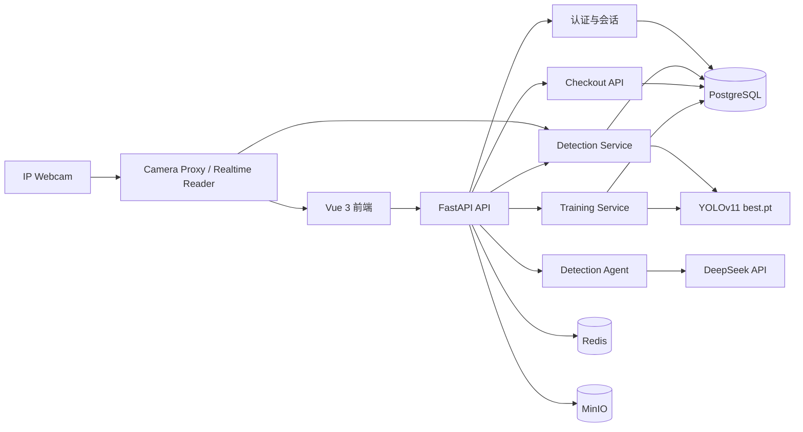
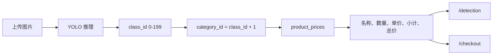

# VisionPay Agent Platform

VisionPay 是一个面向零售自助结算场景的商品视觉识别平台。系统使用 YOLOv11 检测商品，通过 FastAPI 查询商品资料与价格，并由 Vue 3 前端提供模型训练、智能检测和自助结算界面。

## 1. 项目简介

项目围绕“识别商品并生成结算金额”构建，主要处理收银台中多商品、相似包装、遮挡和堆叠等场景。

当前已经实现：

- YOLOv11 单图、多图和 ZIP 商品检测。
- DeepSeek Agent 自然语言检测、工具调用和流式响应。
- 模型训练、指标监控、验证、预测和导出。
- 200 类 RPC 商品资料与价格管理。
- 检测完成后的商品名称、数量、单价、小计和总价计算。
- `/checkout` 图片识别、购物篮调整和服务端重新计价。
- Android IP Webcam 的 MJPEG 实时 YOLO 检测与当前帧计价。

当前已实现 IP Webcam 实时 YOLO 检测与计价，以及动态二维码、手机模拟付款和收银端状态同步。模拟支付不会连接微信、支付宝、银行卡或产生真实资金交易。

## 2. 核心功能

### 2.1 商品检测

- 支持 JPG、PNG、BMP、WEBP 等常见图片格式。
- 支持单图、多图批量和 ZIP 批量检测。
- 返回标注图片、类别、置信度、边界框和推理耗时。
- 自动汇总商品数量并查询商品名称和价格。

### 2.2 智能检测 Agent

- 使用 DeepSeek OpenAI-compatible API。
- 根据自然语言自动选择单图、多图或 ZIP 检测工具。
- 通过 SSE 流式返回回答。
- 保存并恢复用户的检测会话和附件记录。

### 2.3 模型训练

- 管理 YOLOv11 训练任务。
- 展示 Loss、mAP、Precision 和 Recall 等指标。
- 支持训练日志、停止任务、验证、预测、结果下载和模型导出。
- 训练产物按任务 UUID 保存。

### 2.4 商品价格与结算

- `product_prices` 表保存 200 类商品的名称、条码和单价。
- 检测结果通过类别 ID 查询数据库价格。
- `/checkout` 上传图片后生成购物篮和初始总价。
- 修改数量或移除商品时，由后端重新读取单价并计算总价。
- 缺价商品不会计入总价，并会阻止继续结算。

### 2.5 手机摄像头

- 后端代理 Android IP Webcam 的 MJPEG 视频流。
- 后端可直接读取最新帧并通过 YOLO 执行实时检测。
- 前端 `/checkout` 和开发者检测工作台可显示标注画面、当前帧统计与价格。

## 3. 项目架构

### 3.1 总体架构



### 3.2 商品检测与计价流程



### 3.3 技术栈

| 层级 | 技术 |
| ---- | ---- |
| 前端 | Vue 3、Vite、Element Plus、Pinia、Axios、ECharts |
| 后端 | FastAPI、SQLAlchemy、Alembic、Pydantic |
| 训练与推理 | Ultralytics YOLOv11、OpenCV、Pillow |
| 智能体 | LangChain、LangGraph、DeepSeek API |
| 数据库 | PostgreSQL 15、Pgvector |
| 基础服务 | Redis 7、MinIO、Docker Compose |

## 4. 项目目录

```text
agent-platform/
├── backend/
│   ├── app/
│   │   ├── agent/              # Detection Agent
│   │   ├── api/                # FastAPI 路由
│   │   ├── entity/             # ORM 和 Pydantic 模型
│   │   ├── services/           # 检测与业务服务
│   │   └── training/           # 训练、数据转换与指标处理
│   ├── alembic/                # 数据库迁移
│   ├── datasets/vision_pay/    # YOLO 数据集
│   ├── runs/train/             # 训练任务输出
│   ├── tests/                  # 后端测试
│   ├── tools/                  # 数据集和价格初始化工具
│   ├── best.pt                 # 当前固定检测权重
│   ├── main.py                 # FastAPI 入口
│   └── requirements.txt
├── frontend/
│   ├── src/api/                # 前端 API 封装
│   ├── src/components/         # 通用组件
│   ├── src/stores/             # Pinia 状态
│   ├── src/views/              # 检测、训练和结算页面
│   └── tests/                  # 前端测试
├── scripts/                    # 数据处理和部署辅助脚本
├── instances_train2019.json    # 需自行准备的 RPC 商品元数据（Git 忽略）
├── docker-compose.yml
└── README.md
```

数据集、`instances_train2019.json`、训练输出、模型权重、`.env` 和运行日志属于本地运行数据，不随仓库分发。

## 5. 环境要求

| 工具 | 建议版本 | 验证命令 |
| ---- | -------- | -------- |
| Python | 3.10+ | `python --version` |
| Node.js | 18+ | `node --version` |
| Docker Desktop | 24+ | `docker --version` |
| Docker Compose | 2+ | `docker compose version` |
| NVIDIA CUDA | 可选 | `nvidia-smi` |

下面的命令以 Windows PowerShell 为例。Linux 和 macOS 需要调整虚拟环境激活命令及文件路径。

## 6. 项目运行方法

### 6.1 克隆项目

```powershell
git clone https://github.com/Azar233/agent-platform
cd agent-platform
```

### 6.2 启动基础服务

确保 Docker Desktop 已启动：

```powershell
docker compose up -d postgres redis minio
docker compose ps
```

默认服务地址：

| 服务 | 地址 |
| ---- | ---- |
| PostgreSQL | `localhost:5432` |
| Redis | `localhost:6379` |
| MinIO API | `localhost:9000` |
| MinIO Console | `http://localhost:9001` |

### 6.3 安装后端依赖

```powershell
cd backend
python -m venv .venv
.\.venv\Scripts\Activate.ps1
pip install -r requirements.txt
Copy-Item .env.example .env
```

至少检查 `backend/.env` 中的数据库、模型和 Agent 配置：

```env
DB_HOST=localhost
DB_PORT=5432
DB_NAME=vp_agent
DB_USER=vp_admin
DB_PASSWORD=vp_admin

DETECTION_MODEL_PATH=D:/path/to/agent-platform/backend/best.pt

DEEPSEEK_API_KEY=sk-your-api-key
DEEPSEEK_BASE_URL=https://api.deepseek.com
DEEPSEEK_MODEL=deepseek-chat
```

直接使用 `/detection` 的快捷检测或 `/checkout` 时，DeepSeek 可以不配置；自然语言 Agent 功能需要有效的 DeepSeek 配置。

### 6.4 准备检测模型

将用于识别的权重放在：

```text
backend/best.pt
```

在 `backend/.env` 中填写它的绝对路径：

```env
DETECTION_MODEL_PATH=D:/code/Git/Agent/agent-platform/backend/best.pt
```

Windows 下建议使用 `/`。项目移动到其他目录或电脑后，需要同步修改路径。配置了有效的 `DETECTION_MODEL_PATH` 后，检测服务会优先且固定使用该权重。修改 `.env` 后必须重启后端。

### 6.5 初始化数据库和商品价格

先创建或升级数据库表：

```powershell
cd backend
alembic upgrade head
```

仓库不包含 `instances_train2019.json`，使用者需要自行从 Retail Product Checkout（RPC）数据集中取得该商品元数据文件。文件需要包含 `__raw_Chinese_name_df`，其中保存 200 个 SKU 的 `category_id`、商品名、条码和商品大类。

保持文件名不变，并将它放在项目根目录：

```text
agent-platform/
├── instances_train2019.json    # 自行下载，不提交 Git
└── backend/
```

可以在项目根目录先确认文件存在：

```powershell
Test-Path .\instances_train2019.json
```

输出 `True` 后进入后端目录并执行价格初始化：

```powershell
python tools\init_prices.py
```

成功时会看到类似输出：

```text
Loaded 200 SKU definitions ...
Price import complete: created=200, updated=0
```

脚本可以重复运行，已有商品会更新而不会重复插入。当前脚本按 17 个商品大类设置演示价格，并非每个 SKU 的真实市场价格。

该 JSON 已加入 `.gitignore`。请不要使用 `git add -f` 强制提交；其他开发者克隆项目后需要各自在本地准备该文件并运行初始化脚本。

### 6.6 启动后端

```powershell
cd backend
.\.venv\Scripts\Activate.ps1
uvicorn main:app --host 127.0.0.1 --port 8000 --reload
```

后端地址：

- 健康检查：`http://127.0.0.1:8000/api/health`
- 详细健康检查：`http://127.0.0.1:8000/api/health/detail`
- Swagger：`http://127.0.0.1:8000/docs`

### 6.7 启动前端

打开新的 PowerShell，启动统一的 5173 前端服务：

```powershell
cd frontend
npm install
npm run dev
```

访问 `http://127.0.0.1:5173`。登录后可从侧边栏进入“用户结算端”，所有开发、识别、结算和付款确认页面都由该服务提供。

Vite 会监听局域网并把 `/api/*` 请求代理到 `http://localhost:8000`。支付二维码默认使用自动识别的电脑 WLAN IPv4 和 5173 端口；如需手动指定，可在 `frontend/.env` 中配置：

```env
VITE_CHECKOUT_PUBLIC_ORIGIN=http://192.168.1.100:5173
```

### 6.8 启动后检查

1. 打开前端并注册或登录。
2. 进入 `/detection`，上传图片并确认出现检测结果和价格汇总。
3. 进入 `/checkout`，切换到“图片上传”，确认购物篮、数量和总价正常。
4. 增减商品数量，确认页面显示“正在重新计价”并更新服务端总价。

## 7. 环境变量说明

### 7.1 应用与数据库

| 变量 | 默认值 | 必填 | 说明 |
| ---- | ------ | ---- | ---- |
| `APP_NAME` | `Vision Pay` | 否 | 应用名称 |
| `DEBUG` | `true` | 否 | 调试模式 |
| `DB_HOST` | `localhost` | 是 | PostgreSQL 地址 |
| `DB_PORT` | `5432` | 是 | PostgreSQL 端口 |
| `DB_NAME` | `vp_agent` | 是 | 数据库名 |
| `DB_USER` | `vp_admin` | 是 | 数据库用户 |
| `DB_PASSWORD` | `vp_admin` | 是 | 数据库密码 |
| `JWT_SECRET_KEY` | 示例值 | 是 | JWT 签名密钥，生产环境必须更换 |

### 7.2 检测与训练

| 变量 | 默认值 | 必填 | 说明 |
| ---- | ------ | ---- | ---- |
| `DETECTION_MODEL_PATH` | 空 | 推荐 | 固定使用的 `best.pt` 绝对路径 |
| `DETECTION_UPLOAD_DIR` | `.runtime/uploads` | 否 | 检测上传目录 |
| `DETECTION_OUTPUT_DIR` | `runs/detect` | 否 | 检测输出目录 |
| `DETECTION_MAX_FILE_MB` | `20` | 否 | 单文件大小上限 |
| `DETECTION_MAX_BATCH_SIZE` | `30` | 否 | 单次批量上限 |
| `DETECTION_VIDEO_MAX_FILE_MB` | `50` | 否 | 上传视频大小上限 |
| `VIDEO_FRAME_SAMPLE_RATE` | `5` | 否 | 视频默认采样帧间隔 |
| `VIDEO_MAX_KEY_FRAMES` | `50` | 否 | 单个视频最多检测关键帧数 |
| `VIDEO_TASK_TTL_SECONDS` | `3600` | 否 | 视频任务进度缓存有效期（秒） |
| `VIDEO_RESULT_DIR` | `runs/detect/video-results` | 否 | 视频完整结果文件目录 |
| `TRAIN_OUTPUT_DIR` | `runs/train` | 否 | 训练输出目录 |
| `DATASET_BASE_DIR` | `datasets` | 否 | 数据集根目录 |
| `YOLO_CONFIG_DIR` | `.ultralytics` | 否 | Ultralytics 配置目录 |

### 7.3 Agent 与基础服务

| 变量 | 默认值 | 必填 | 说明 |
| ---- | ------ | ---- | ---- |
| `DEEPSEEK_API_KEY` | 空 | Agent 必填 | DeepSeek API Key |
| `DEEPSEEK_BASE_URL` | `https://api.deepseek.com` | Agent 必填 | API 地址 |
| `DEEPSEEK_MODEL` | `deepseek-chat` | Agent 必填 | 模型标识 |
| `DEEPSEEK_TEMPERATURE` | `0.1` | 否 | Agent 温度 |
| `REDIS_HOST` | `localhost` | 是 | Redis 地址 |
| `REDIS_PORT` | `6379` | 是 | Redis 端口 |
| `MINIO_ENDPOINT` | `localhost:9000` | 是 | MinIO 地址 |
| `MINIO_ACCESS_KEY` | `minioadmin` | 是 | MinIO 用户 |
| `MINIO_SECRET_KEY` | `minioadmin` | 是 | MinIO 密码 |
| `MINIO_BUCKET` | `vp-images` | 否 | MinIO Bucket |
| `ALLOWED_ORIGINS` | 多个本地地址 | 否 | CORS 白名单 |

## 8. 使用方法

### 8.1 检测工作台 `/detection`

1. 注册并登录。
2. 选择单图、多图、ZIP、视频或实时模式。
3. 添加文件并设置置信度、IoU 和场景 ID。
4. 点击“立即识别”，或者输入自然语言交给 Agent。
5. 查看标注图、类别、置信度、商品数量、价格明细和总价。

检测结果中的 `price_summary` 会说明价格是否完整。缺少价格的商品会显示“未定价”，且不会被悄悄计入完整总价。

视频模式支持 MP4、AVI、MOV 和 MKV，单文件最大 50MB。上传成功后后端异步处理，默认每 5 帧采样一次，并根据视频总帧数自动增大间隔，将关键帧限制在 50 个以内。页面展示检测进度、标注关键帧、视频信息和类别统计；其中商品数量是各采样帧检测次数之和，暂不做跨帧目标去重，也不生成完整标注视频。

### 8.2 自助结算 `/checkout`

1. 建议先登录，再访问 `/checkout`，因为识别和重新计价 API 当前需要 JWT。
2. 切换到“图片上传”并选择一张结算图片。
3. 后端调用固定的 `best.pt` 完成商品识别和初始计价。
4. 在购物篮中增减数量或移除商品。
5. 每次修改都会调用 `/api/checkout/calculate`，单价从数据库重新读取。
6. 价格完整时，后端重新查价并创建 10 分钟有效的模拟支付订单。
7. `/checkout/payment` 生成包含随机支付令牌的局域网二维码，并每秒同步订单状态。
8. 手机扫码进入 `/mock-pay/{payment_token}`，确认模拟付款后，手机和收银端同步显示成功。

模拟支付金额和商品快照由后端保存，手机端不能提交金额；订单只允许从 `pending` 原子更新为 `paid`，重复确认不会重复付款。二维码过期后需在收银端重新生成。

### 8.3 IP Webcam

1. 手机和电脑连接同一个 Wi-Fi。
2. 在 Android IP Webcam 中启动服务器。
3. 确认电脑能访问手机显示的局域网地址。
4. 默认地址为 `http://10.172.52.70:8080`；也可以在 `backend/.env` 中修改 `IP_WEBCAM_URL`。
5. 打开 `/checkout` 的 Webcam 模式，或在开发者检测工作台选择“实时”，在面板顶部可直接修改手机地址。

后端只接受私有局域网 IP Webcam 地址。前端填写的地址会保存在当前浏览器，连接时由后端再次校验并自动补全 `/video`。实时模式由后端直接读取 MJPEG 流，以 CPU 416×416、目标 3 FPS 执行 YOLO 推理，通过 `/api/detection/camera` WebSocket 返回标注帧、当前帧商品统计和价格。系统一次只允许一个实时检测会话。

### 8.4 前端页面

| 路由 | 功能 |
| ---- | ---- |
| `/login` | 登录 |
| `/register` | 注册 |
| `/detection` | 检测工作台与 Agent |
| `/training` | 模型训练与监控 |
| `/checkout` | 登录后的自助识别和结算，位于主侧边栏 |
| `/checkout/payment` | 登录后的商品及金额确认 |
| `http://<局域网IP>:5173/mock-pay/{payment_token}` | 手机免登录模拟付款 |
| `/history` | 历史记录页面 |
| `/dashboard` | 数据看板页面 |

## 9. API 概览

除健康检查、摄像头代理和前端公开页面外，业务 API 通常需要 JWT：

```http
Authorization: Bearer <access_token>
```

详细请求和响应模型请查看 `http://127.0.0.1:8000/docs`。

### 9.1 认证与健康检查

| 方法 | 路径 | 说明 |
| ---- | ---- | ---- |
| `POST` | `/api/auth/register` | 注册 |
| `POST` | `/api/auth/login` | 登录并获取 Token |
| `GET` | `/api/auth/me` | 当前用户 |
| `GET` | `/api/health` | 基础健康检查 |
| `GET` | `/api/health/detail` | 数据库、Redis、MinIO 检查 |

### 9.2 检测与 Agent

| 方法 | 路径 | 说明 |
| ---- | ---- | ---- |
| `POST` | `/api/detection/single` | 单图检测 |
| `POST` | `/api/detection/batch` | 多图检测 |
| `POST` | `/api/detection/zip` | ZIP 批量检测 |
| `POST` | `/api/detection/video` | 上传视频并创建异步关键帧检测任务 |
| `GET` | `/api/detection/video/status/{task_id}` | 查询视频检测进度和结果 |
| `GET` | `/api/chat/status` | Agent 配置状态 |
| `POST` | `/api/chat/upload` | 上传 Agent 附件 |
| `POST` | `/api/chat/stream` | SSE Agent 对话 |
| `POST` | `/api/chat/sessions` | 创建会话 |
| `GET` | `/api/chat/sessions` | 会话列表 |
| `GET` | `/api/chat/sessions/{session_uuid}` | 会话详情 |
| `DELETE` | `/api/chat/sessions/{session_uuid}` | 删除会话 |

### 9.3 结算与价格

| 方法 | 路径 | 说明 |
| ---- | ---- | ---- |
| `POST` | `/api/checkout/detect` | 识别结算图片并计算初始总价 |
| `POST` | `/api/checkout/calculate` | 按确认数量进行服务端重新计价 |
| `POST` | `/api/mock-pay/orders` | 重新查价并创建模拟支付订单 |
| `GET` | `/api/mock-pay/orders/{order_uuid}/status` | 查询收银端支付状态 |
| `GET` | `/api/mock-pay/{payment_token}` | 读取手机端订单快照 |
| `POST` | `/api/mock-pay/{payment_token}/confirm` | 原子确认模拟付款 |
| `GET` | `/api/prices` | 获取所有价格 |
| `GET` | `/api/prices/{category_id}` | 获取单个商品价格 |
| `POST` | `/api/prices/batch` | 批量创建或更新价格 |
| `GET` | `/api/camera/ip-webcam/stream` | 代理 IP Webcam 视频流 |
| `GET` | `/api/camera/ip-webcam/config` | 查询服务端摄像头配置状态（不返回局域网地址） |
| `WS` | `/api/detection/camera` | IP Webcam 实时 YOLO 检测 |

### 9.4 模型训练

| 方法 | 路径 | 说明 |
| ---- | ---- | ---- |
| `POST` | `/api/training/start` | 启动训练 |
| `POST` | `/api/training/import-run` | 导入已有训练结果 |
| `GET` | `/api/training/tasks` | 训练任务列表 |
| `GET` | `/api/training/status/{task_id}` | 训练状态 |
| `GET` | `/api/training/metrics/{task_id}` | 训练指标 |
| `GET` | `/api/training/logs/{task_id}` | 训练日志 |
| `POST` | `/api/training/validate/{task_id}` | 验证模型 |
| `POST` | `/api/training/export/{task_id}` | 导出模型版本 |
| `POST` | `/api/training/predict` | 使用训练模型预测 |
| `POST` | `/api/training/stop/{task_id}` | 停止训练 |
| `GET` | `/api/training/results/{task_uuid}` | 下载训练结果 |

## 10. 测试与构建

### 10.1 后端测试

```powershell
cd backend
.\.venv\Scripts\Activate.ps1
pytest -q
```

检测与结算专项测试：

```powershell
pytest tests\test_detection_api.py tests\test_checkout_api.py -q
```

测试覆盖鉴权、上传参数、检测结果计价、0/1 类别映射、数据库权威单价、重复类别合并和数量边界。

### 10.2 前端测试

```powershell
cd frontend
npm run test:run
```

### 10.3 前端生产构建

```powershell
cd frontend
npm run build
```

## 11. 补充内容

### 11.1 模型训练

训练数据默认位于 `backend/datasets/vision_pay/`，入口文件为 `data.yaml`。可以使用 `backend/tools/` 下的转换、修复、验证和可视化脚本准备数据，也可以在前端 `/training` 创建任务。训练产物保存在：

```text
backend/runs/train/task_<task_uuid>/weights/best.pt
```

如需将某个训练结果固定用于检测，可以把权重复制为 `backend/best.pt`，并更新 `.env` 中的 `DETECTION_MODEL_PATH`。

### 11.2 商品类别与价格映射

YOLO 使用 0–199 的 `class_id`，`instances_train2019.json` 和 `product_prices` 使用 1–200 的 `category_id`，后端按下面的规则查询商品：

```text
category_id = class_id + 1
```

模型权重提供 `1_puffed_food` 形式的技术类别名；中文商品名、条码和商品大类来自 `instances_train2019.json`，由 `init_prices.py` 导入数据库。最终单价只从数据库读取，Agent 和前端都不负责生成或决定价格。
