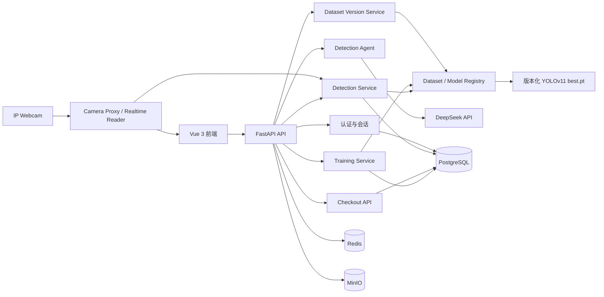
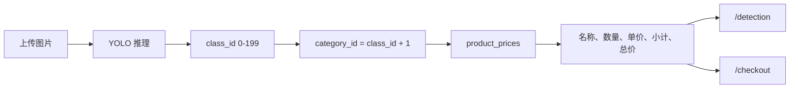

# VisionPay Agent Platform

VisionPay 是一个面向零售自助结算场景的商品视觉识别平台。系统使用 YOLOv11 检测商品，通过 FastAPI 查询商品资料与价格，并由 Vue 3 前端提供模型训练、智能检测和自助结算界面。

## 1. 项目简介

项目围绕“识别商品并生成结算金额”构建，主要处理收银台中多商品、相似包装、遮挡和堆叠等场景。

当前已经实现：

- YOLOv11 单图、多图和 ZIP 商品检测。
- DeepSeek Agent 自然语言检测、工具调用和流式响应。
- 模型训练、指标监控、验证、预测和导出。
- 数据集基线导入、派生版本、商品样本增删、检测框审核和版本冻结。
- 训练产物与数据集版本自动关联，并可在前端切换检测使用的模型版本。
- 200 类 RPC 商品资料与价格管理。
- 检测完成后的商品名称、数量、单价、小计和总价计算。
- `/checkout` 图片识别、购物篮调整和服务端重新计价。
- Android IP Webcam 的 MJPEG 实时 YOLO 检测与当前帧计价。

当前已实现 IP Webcam 实时 YOLO 检测与计价，以及动态二维码、手机模拟付款和收银端状态同步。模拟支付不会连接微信、支付宝、银行卡或产生真实资金交易。

## 2. 核心功能

### 2.1 商品检测

- 支持 JPG、PNG、BMP、WEBP 等常见图片格式。
- 支持单图、多图批量和 ZIP 批量检测。
- 返回标注图片、类别、置信度、边界框和推理耗时。
- 自动汇总商品数量并查询商品名称和价格。

### 2.2 智能检测 Agent

- 使用 DeepSeek OpenAI-compatible API。
- 根据自然语言自动选择单图、多图或 ZIP 检测工具。
- 通过 SSE 流式返回回答。
- 保存并恢复用户的检测会话和附件记录。

### 2.3 模型训练

- 管理 YOLOv11 训练任务。
- 展示 Loss、mAP、Precision 和 Recall 等指标。
- 支持训练日志、停止任务、验证、预测、结果下载和模型导出。
- 训练产物按任务 UUID 保存。
- 每个训练任务的 `best.pt` 自动登记为独立模型版本，并记录所用数据集、训练参数和训练结果。
- 同一数据集版本可以重复训练并产生多个可切换的模型版本。

### 2.4 数据集版本管理

- 导入已有 YOLO dataset 作为不可变基线，并扫描图片、标注和类别映射。
- 使用稳定的 `product_id` 与 `product_key` 保持商品跨数据集版本身份一致。
- 从冻结版本派生草稿，在草稿中添加或删除商品、审核检测框并自动更新 YOLO 文件。
- 校验并冻结草稿后，可将其用于训练或设为场景的当前数据集。

### 2.5 商品价格与结算

- `product_prices` 表保存 200 类商品的名称、条码和单价。
- 检测结果通过类别 ID 查询数据库价格。
- `/checkout` 上传图片后生成购物篮和初始总价。
- 修改数量或移除商品时，由后端重新读取单价并计算总价。
- 缺价商品不会计入总价，并会阻止继续结算。

### 2.6 手机摄像头

- 后端代理 Android IP Webcam 的 MJPEG 视频流。
- 后端可直接读取最新帧并通过 YOLO 执行实时检测。
- 前端 `/checkout` 和开发者检测工作台可显示标注画面、当前帧统计与价格。

## 3. 项目架构

### 3.1 总体架构



### 3.2 商品检测与计价流程



### 3.3 技术栈

| 层级 | 技术 |
| ---- | ---- |
| 前端 | Vue 3、Vite、Element Plus、Pinia、Axios、ECharts |
| 后端 | FastAPI、SQLAlchemy、Alembic、Pydantic |
| 训练与推理 | Ultralytics YOLOv11、OpenCV、Pillow |
| 智能体 | LangChain、LangGraph、DeepSeek API |
| 数据库 | PostgreSQL 15、Pgvector |
| 基础服务 | Redis 7、MinIO、Docker Compose |

## 4. 项目目录

```text
agent-platform/
├── backend/
│   ├── app/
│   │   ├── agent/              # Detection Agent
│   │   ├── api/                # FastAPI 路由
│   │   ├── entity/             # ORM 和 Pydantic 模型
│   │   ├── services/           # 检测与业务服务
│   │   └── training/           # 训练、数据转换与指标处理
│   ├── alembic/                # 数据库迁移
│   ├── datasets/vision_pay/    # YOLO 数据集
│   ├── runs/train/             # 训练任务输出
│   ├── tests/                  # 后端测试
│   ├── tools/                  # 数据集和价格初始化工具
│   ├── best.pt                 # 内置正式检测权重（正式版v1.0）
│   ├── main.py                 # FastAPI 入口
│   └── requirements.txt
├── frontend/
│   ├── src/api/                # 前端 API 封装
│   ├── src/components/         # 通用组件
│   ├── src/stores/             # Pinia 状态
│   ├── src/views/              # 检测、训练和结算页面
│   └── tests/                  # 前端测试
├── scripts/                    # 数据处理和部署辅助脚本
├── instances_train2019.json    # 需自行准备的 RPC 商品元数据（Git 忽略）
├── docker-compose.yml
└── README.md
```

数据集、`instances_train2019.json`、训练输出、模型权重、`.env` 和运行日志属于本地运行数据，不随仓库分发。

## 5. 环境要求

| 工具 | 建议版本 | 验证命令 |
| ---- | -------- | -------- |
| Python | 3.10+ | `python --version` |
| Node.js | 18+ | `node --version` |
| Docker Desktop | 24+ | `docker --version` |
| Docker Compose | 2+ | `docker compose version` |
| NVIDIA CUDA | 可选 | `nvidia-smi` |

下面的命令以 Windows PowerShell 为例。Linux 和 macOS 需要调整虚拟环境激活命令及文件路径。

## 6. 项目运行方法

### 6.1 克隆项目

```powershell
git clone https://github.com/Azar233/agent-platform
cd agent-platform
```

### 6.2 启动基础服务

确保 Docker Desktop 已启动：

```powershell
docker compose up -d postgres redis minio
docker compose ps
```

默认服务地址：

| 服务 | 地址 |
| ---- | ---- |
| PostgreSQL | `localhost:5432` |
| Redis | `localhost:6379` |
| MinIO API | `localhost:9000` |
| MinIO Console | `http://localhost:9001` |

### 6.3 安装后端依赖

```powershell
cd backend
python -m venv .venv
.\.venv\Scripts\Activate.ps1
pip install -r requirements.txt
Copy-Item .env.example .env
```

至少检查 `backend/.env` 中的数据库、模型和 Agent 配置：

```env
DB_HOST=localhost
DB_PORT=5432
DB_NAME=vp_agent
DB_USER=vp_admin
DB_PASSWORD=vp_admin

DETECTION_MODEL_PATH=D:/path/to/agent-platform/backend/best.pt

DEEPSEEK_API_KEY=sk-your-api-key
DEEPSEEK_BASE_URL=https://api.deepseek.com
DEEPSEEK_MODEL=deepseek-chat
```

直接使用 `/detection` 的快捷检测或 `/checkout` 时，DeepSeek 可以不配置；自然语言 Agent 功能需要有效的 DeepSeek 配置。

### 6.4 准备检测模型

将用于识别的权重放在：

```text
backend/best.pt
```

在 `backend/.env` 中填写它的绝对路径：

```env
DETECTION_MODEL_PATH=D:/code/Git/Agent/agent-platform/backend/best.pt
```

Windows 下建议使用 `/`。项目移动到其他目录或电脑后，需要同步修改路径。`backend/best.pt` 会自动登记为“正式版v1.0”，用于兼容系统原有检测模型。检测服务优先使用数据库中为当前场景选中的模型版本；`DETECTION_MODEL_PATH` 仅在尚未登记或选择模型版本时作为兼容后备。修改 `.env` 后必须重启后端。

### 6.5 初始化数据库和商品价格

先创建或升级数据库表：

```powershell
cd backend
alembic upgrade head
```

仓库不包含 `instances_train2019.json`，使用者需要自行从 Retail Product Checkout（RPC）数据集中取得该商品元数据文件。文件需要包含 `__raw_Chinese_name_df`，其中保存 200 个 SKU 的 `category_id`、商品名、条码和商品大类。

保持文件名不变，并将它放在项目根目录：

```text
agent-platform/
├── instances_train2019.json    # 自行下载，不提交 Git
└── backend/
```

可以在项目根目录先确认文件存在：

```powershell
Test-Path .\instances_train2019.json
```

输出 `True` 后进入后端目录并执行价格初始化：

```powershell
python tools\init_prices.py
```

成功时会看到类似输出：

```text
Loaded 200 SKU definitions ...
Price import complete: created=200, updated=0
```

脚本可以重复运行，已有商品会更新而不会重复插入。当前脚本按 17 个商品大类设置演示价格，并非每个 SKU 的真实市场价格。

该 JSON 已加入 `.gitignore`。请不要使用 `git add -f` 强制提交；其他开发者克隆项目后需要各自在本地准备该文件并运行初始化脚本。

### 6.6 启动后端

```powershell
cd backend
.\.venv\Scripts\Activate.ps1
uvicorn main:app --host 127.0.0.1 --port 8000 --reload
```

后端地址：

- 健康检查：`http://127.0.0.1:8000/api/health`
- 详细健康检查：`http://127.0.0.1:8000/api/health/detail`
- Swagger：`http://127.0.0.1:8000/docs`

### 6.7 启动前端

打开新的 PowerShell，启动统一的 5173 前端服务：

```powershell
cd frontend
npm install
npm run dev
```

访问 `http://127.0.0.1:5173`。登录后可从侧边栏进入“用户结算端”，所有开发、识别、结算和付款确认页面都由该服务提供。

Vite 会监听局域网并把 `/api/*` 请求代理到 `http://localhost:8000`。支付二维码默认使用自动识别的电脑 WLAN IPv4 和 5173 端口；如需手动指定，可在 `frontend/.env` 中配置：

```env
VITE_CHECKOUT_PUBLIC_ORIGIN=http://192.168.1.100:5173
```

### 6.8 启动后检查

1. 打开前端并注册或登录。
2. 进入 `/detection`，上传图片并确认出现检测结果和价格汇总。
3. 进入 `/checkout`，切换到“图片上传”，确认购物篮、数量和总价正常。
4. 增减商品数量，确认页面显示“正在重新计价”并更新服务端总价。

## 7. 环境变量说明

### 7.1 应用与数据库

| 变量 | 默认值 | 必填 | 说明 |
| ---- | ------ | ---- | ---- |
| `APP_NAME` | `Vision Pay` | 否 | 应用名称 |
| `DEBUG` | `true` | 否 | 调试模式 |
| `DB_HOST` | `localhost` | 是 | PostgreSQL 地址 |
| `DB_PORT` | `5432` | 是 | PostgreSQL 端口 |
| `DB_NAME` | `vp_agent` | 是 | 数据库名 |
| `DB_USER` | `vp_admin` | 是 | 数据库用户 |
| `DB_PASSWORD` | `vp_admin` | 是 | 数据库密码 |
| `JWT_SECRET_KEY` | 示例值 | 是 | JWT 签名密钥，生产环境必须更换 |

### 7.2 检测与训练

| 变量 | 默认值 | 必填 | 说明 |
| ---- | ------ | ---- | ---- |
| `DETECTION_MODEL_PATH` | 空 | 推荐 | 未选择模型版本时使用的兼容 `best.pt` 路径 |
| `DETECTION_UPLOAD_DIR` | `.runtime/uploads` | 否 | 检测上传目录 |
| `DETECTION_OUTPUT_DIR` | `runs/detect` | 否 | 检测输出目录 |
| `DETECTION_MAX_FILE_MB` | `20` | 否 | 单文件大小上限 |
| `DETECTION_MAX_BATCH_SIZE` | `30` | 否 | 单次批量上限 |
| `DETECTION_VIDEO_MAX_FILE_MB` | `50` | 否 | 上传视频大小上限 |
| `VIDEO_FRAME_SAMPLE_RATE` | `5` | 否 | 视频默认采样帧间隔 |
| `VIDEO_MAX_KEY_FRAMES` | `50` | 否 | 单个视频最多检测关键帧数 |
| `VIDEO_TASK_TTL_SECONDS` | `3600` | 否 | 视频任务进度缓存有效期（秒） |
| `VIDEO_RESULT_DIR` | `runs/detect/video-results` | 否 | 视频完整结果文件目录 |
| `IP_WEBCAM_URL` | `http://10.172.52.70:8080` | 否 | 手机 IP Webcam 默认地址，前端可覆盖 |
| `CAMERA_CONFIDENCE` | `0.30` | 否 | 实时检测最低置信度 |
| `CAMERA_IMAGE_SIZE` | `512` | 否 | CPU 实时推理输入尺寸 |
| `CAMERA_TARGET_FPS` | `3` | 否 | 实时检测目标帧率 |
| `CAMERA_JPEG_QUALITY` | `62` | 否 | 标注帧 JPEG 质量 |
| `CAMERA_OUTPUT_MAX_WIDTH` | `960` | 否 | 发送到前端的标注画面最大宽度 |
| `CAMERA_READ_TIMEOUT_MS` | `2000` | 否 | MJPEG 单次读取超时 |
| `CAMERA_STALE_TIMEOUT_SECONDS` | `5` | 否 | 无新画面后的会话失败时间 |
| `CAMERA_STABILITY_MIN_HITS` | `2` | 否 | 目标至少连续命中的帧数 |
| `CAMERA_STABILITY_MAX_MISSES` | `2` | 否 | 稳定目标允许短暂漏检的帧数 |
| `CAMERA_STABILITY_IOU` | `0.25` | 否 | 跨帧目标空间匹配阈值 |
| `TRAIN_OUTPUT_DIR` | `runs/train` | 否 | 训练输出目录 |
| `DATASET_BASE_DIR` | `datasets` | 否 | 数据集根目录 |
| `YOLO_CONFIG_DIR` | `.ultralytics` | 否 | Ultralytics 配置目录 |

### 7.3 Agent 与基础服务

| 变量 | 默认值 | 必填 | 说明 |
| ---- | ------ | ---- | ---- |
| `DEEPSEEK_API_KEY` | 空 | Agent 必填 | DeepSeek API Key |
| `DEEPSEEK_BASE_URL` | `https://api.deepseek.com` | Agent 必填 | API 地址 |
| `DEEPSEEK_MODEL` | `deepseek-chat` | Agent 必填 | 模型标识 |
| `DEEPSEEK_TEMPERATURE` | `0.1` | 否 | Agent 温度 |
| `REDIS_HOST` | `localhost` | 是 | Redis 地址 |
| `REDIS_PORT` | `6379` | 是 | Redis 端口 |
| `MINIO_ENDPOINT` | `localhost:9000` | 是 | MinIO 地址 |
| `MINIO_ACCESS_KEY` | `minioadmin` | 是 | MinIO 用户 |
| `MINIO_SECRET_KEY` | `minioadmin` | 是 | MinIO 密码 |
| `MINIO_BUCKET` | `vp-images` | 否 | MinIO Bucket |
| `ALLOWED_ORIGINS` | 多个本地地址 | 否 | CORS 白名单 |

## 8. 使用方法

### 8.1 检测工作台 `/detection`

1. 注册并登录。
2. 选择单图、多图、ZIP、视频或实时模式。
3. 添加文件并设置置信度、IoU 和场景 ID。
4. 点击“立即识别”，或者输入自然语言交给 Agent。
5. 查看标注图、类别、置信度、商品数量、价格明细和总价。

检测结果中的 `price_summary` 会说明价格是否完整。缺少价格的商品会显示“未定价”，且不会被悄悄计入完整总价。

#### 上传视频检测

1. 按照 6.6 和 6.7 节启动后端与前端，登录后进入 `/detection`。
2. 在检测模式中选择“视频”。
3. 选择一个 MP4、AVI、MOV 或 MKV 文件；默认单文件最大为 50MB。
4. 根据需要设置场景 ID、置信度和 IoU，然后点击“立即识别”。
5. 上传成功后，后端会创建异步任务；保持页面打开，前端会自动查询并显示处理进度。
6. 任务完成后，可查看视频时长、FPS、分辨率、标注关键帧和类别统计。

后端默认每 5 帧采样一次，并根据视频总帧数自动增大采样间隔，将关键帧限制在 50 个以内。结果中的商品数量是所有采样帧检测次数之和，暂不进行跨帧目标跟踪或去重，也不会生成一份完整的标注视频。因此，同一件商品持续出现在多个采样帧时，可能被统计多次。

### 8.2 自助结算 `/checkout`

1. 建议先登录，再访问 `/checkout`，因为识别和重新计价 API 当前需要 JWT。
2. 切换到“图片上传”并选择一张结算图片。
3. 后端调用当前场景选中的模型版本完成商品识别和初始计价。
4. 在购物篮中增减数量或移除商品。
5. 每次修改都会调用 `/api/checkout/calculate`，单价从数据库重新读取。
6. 价格完整时，后端重新查价并创建 10 分钟有效的模拟支付订单。
7. `/checkout/payment` 生成包含随机支付令牌的局域网二维码，并每秒同步订单状态。
8. 手机扫码进入 `/mock-pay/{payment_token}`，确认模拟付款后，手机和收银端同步显示成功。

模拟支付金额和商品快照由后端保存，手机端不能提交金额；订单只允许从 `pending` 原子更新为 `paid`，重复确认不会重复付款。二维码过期后需在收银端重新生成。

### 8.3 IP Webcam 实时检测

实时检测使用 Android 手机上的 IP Webcam 提供 MJPEG 视频流。手机负责拍摄，运行后端的电脑负责执行 YOLO 推理。

#### 8.3.1 安装并设置手机应用

1. 在 Android 应用商店或 [Google Play](https://play.google.com/store/apps/details?id=com.pas.webcam) 搜索并安装 **IP Webcam**（开发者 Pavel Khlebovich），然后授予相机权限。
2. 为兼顾 CPU 检测速度和画面清晰度，建议先使用以下手机参数：
   - 分辨率：`640 × 480`
   - 帧率：`10–15 FPS`
   - 视频质量：`50–70`
   - 音频：关闭（检测不使用音频）
3. 将手机和运行本项目的电脑连接到同一个普通 Wi-Fi。不要使用开启了客户端隔离的访客网络；手机热点也可以使用，但必须保证电脑能够访问手机的局域网地址。
4. 在 IP Webcam 设置页面滑到底部，点击“启动服务器”。应用会在画面底部显示类似 `http://10.172.52.70:8080` 的地址，请记录实际显示的地址；手机重新联网后，该 IP 可能发生变化。

#### 8.3.2 检查电脑与手机的连接

将下面示例中的 IP 和端口替换为手机实际显示的值：

```powershell
Test-NetConnection 10.172.52.70 -Port 8080
```

确认输出中的 `TcpTestSucceeded` 为 `True`，再用电脑浏览器打开：

```text
http://10.172.52.70:8080/video
```

能够看到实时 MJPEG 画面后，再继续启动检测。如果端口不通，优先检查手机服务是否仍在运行、两台设备是否在同一局域网、手机 IP 是否变化，以及 Windows 防火墙或路由器的 AP/客户端隔离设置。

#### 8.3.3 配置后端 `.env`

`backend/.env` 属于本机配置，不会随 Git 提交或 `pull` 到另一台电脑。首次运行或换电脑后，需要在项目根目录执行：

```powershell
Copy-Item backend/.env.example backend/.env
```

至少检查模型路径和默认摄像头地址：

```env
DETECTION_MODEL_PATH=D:/absolute/path/to/best.pt
IP_WEBCAM_URL=http://10.172.52.70:8080

# 以下是适合 CPU 实时检测的默认参数，可按机器性能调整
CAMERA_CONFIDENCE=0.30
CAMERA_IMAGE_SIZE=512
CAMERA_TARGET_FPS=3
```

如果需要使用 `DETECTION_MODEL_PATH` 兼容后备，它必须是当前电脑上真实存在的 `best.pt` 绝对路径，不能直接沿用另一台电脑的路径。数据库中已经选择模型版本时，应优先确认该模型版本记录的文件路径在当前节点可用。`IP_WEBCAM_URL` 填写基础地址即可，不需要添加 `/video`。修改 `.env` 后必须重启后端进程。

#### 8.3.4 启动并在前端连接

在第一个 PowerShell 中启动后端：

```powershell
cd backend
.\.venv\Scripts\Activate.ps1
uvicorn main:app --host 127.0.0.1 --port 8000 --reload
```

在第二个 PowerShell 中启动前端：

```powershell
cd frontend
npm install
npm run dev
```

登录前端后，可通过以下任一入口使用实时检测：

- 进入 `/checkout`，切换到 Webcam 模式。
- 进入 `/detection`，选择“实时”模式。

在实时检测面板顶部直接输入手机显示的基础地址，例如 `http://10.172.52.70:8080`，然后连接。后端会校验该地址是否为私有局域网 IPv4，并自动补全 `/video`。

#### 8.3.5 摄像头地址保存与覆盖规则

摄像头地址按以下规则生效：

1. 前端输入的地址优先级最高。它保存在当前浏览器的 `localStorage` 中，键名为 `visionpay-ip-webcam-url`，并在建立 WebSocket 时作为 `camera_url` 发送给后端。
2. 当前浏览器没有保存地址时，页面会显示并发送前端内置的默认地址 `http://10.172.52.70:8080`，使用者可以直接改成手机当前地址。
3. 只有调用方没有向 WebSocket 发送 `camera_url` 时，后端才回退到 `backend/.env` 中的 `IP_WEBCAM_URL`；如果该变量也未配置，则使用后端代码中的默认值。

因此，在前端修改 IP 会立即改变当前浏览器后续使用的摄像头地址，但**不会修改 `backend/.env` 文件**。清除该网站的浏览器存储后，前端保存的地址会消失，页面会恢复为前端内置默认地址。正常使用网页时，以面板中当前显示的地址为准；`IP_WEBCAM_URL` 可作为后端接口或其他 WebSocket 客户端未传地址时的默认配置。

#### 8.3.6 常见问题

- **另一台电脑 `pull` 后无法检测**：确认当前选中模型版本的 `best.pt` 路径在该电脑上可用；如果尚未登记模型版本，再检查 `backend/best.pt` 和兼容配置 `DETECTION_MODEL_PATH`。同时重新测试手机端口是否可达。
- **提示无法连接摄像头**：确认 IP Webcam 仍在前台或后台运行，重新核对手机当前 IP，并检查两台设备是否处于同一局域网且未启用客户端隔离。
- **提示摄像头被其他会话使用**：打开新检测页面会接管旧会话。如果仍持续提示，关闭旧页面并重启后端，避免旧版本后端进程仍占用端口或摄像头连接。
- **画面延迟高**：优先将手机分辨率调至 `640 × 480`、帧率调至 `10–15 FPS` 并关闭音频；也可适当降低 `CAMERA_IMAGE_SIZE` 或 `CAMERA_TARGET_FPS`，但会牺牲一定精度或流畅度。
- **检测结果不稳定或精度低**：使用均匀光照，让商品占据画面较大区域并尽量保持稳定；避免直接拍摄电脑显示器，以免摩尔纹和反光降低识别精度。

实时模式使用独立采集线程持续丢弃 MJPEG 旧帧，只对最新帧执行 CPU 512×512、目标 3 FPS 的 YOLO 推理。检测结果经过跨帧空间匹配、类别加权投票和框位置平滑后展示；标注画面限制为最大 960px，并通过 `/api/detection/camera` WebSocket 返回。系统一次只保留一个实时检测会话，新页面会接管并停止旧页面的会话。

### 8.4 前端页面

| 路由 | 功能 |
| ---- | ---- |
| `/login` | 登录 |
| `/register` | 注册 |
| `/detection` | 检测工作台与 Agent |
| `/training` | 模型训练与监控 |
| `/datasets` | 数据集基线、派生版本和商品样本管理 |
| `/checkout` | 登录后的自助识别和结算，位于主侧边栏 |
| `/checkout/payment` | 登录后的商品及金额确认 |
| `http://<局域网IP>:5173/mock-pay/{payment_token}` | 手机免登录模拟付款 |
| `/history` | 历史记录页面 |
| `/dashboard` | 数据看板页面 |

## 9. API 概览

除健康检查、摄像头代理和前端公开页面外，业务 API 通常需要 JWT：

```http
Authorization: Bearer <access_token>
```

详细请求和响应模型请查看 `http://127.0.0.1:8000/docs`。

### 9.1 认证与健康检查

| 方法 | 路径 | 说明 |
| ---- | ---- | ---- |
| `POST` | `/api/auth/register` | 注册 |
| `POST` | `/api/auth/login` | 登录并获取 Token |
| `GET` | `/api/auth/me` | 当前用户 |
| `GET` | `/api/health` | 基础健康检查 |
| `GET` | `/api/health/detail` | 数据库、Redis、MinIO 检查 |

### 9.2 检测与 Agent

| 方法 | 路径 | 说明 |
| ---- | ---- | ---- |
| `POST` | `/api/detection/single` | 单图检测 |
| `POST` | `/api/detection/batch` | 多图检测 |
| `POST` | `/api/detection/zip` | ZIP 批量检测 |
| `POST` | `/api/detection/video` | 上传视频并创建异步关键帧检测任务 |
| `GET` | `/api/detection/video/status/{task_id}` | 查询视频检测进度和结果 |
| `GET` | `/api/chat/status` | Agent 配置状态 |
| `POST` | `/api/chat/upload` | 上传 Agent 附件 |
| `POST` | `/api/chat/stream` | SSE Agent 对话 |
| `POST` | `/api/chat/sessions` | 创建会话 |
| `GET` | `/api/chat/sessions` | 会话列表 |
| `GET` | `/api/chat/sessions/{session_uuid}` | 会话详情 |
| `DELETE` | `/api/chat/sessions/{session_uuid}` | 删除会话 |

### 9.3 结算与价格

| 方法 | 路径 | 说明 |
| ---- | ---- | ---- |
| `POST` | `/api/checkout/detect` | 识别结算图片并计算初始总价 |
| `POST` | `/api/checkout/calculate` | 按确认数量进行服务端重新计价 |
| `POST` | `/api/mock-pay/orders` | 重新查价并创建模拟支付订单 |
| `GET` | `/api/mock-pay/orders/{order_uuid}/status` | 查询收银端支付状态 |
| `GET` | `/api/mock-pay/{payment_token}` | 读取手机端订单快照 |
| `POST` | `/api/mock-pay/{payment_token}/confirm` | 原子确认模拟付款 |
| `GET` | `/api/prices` | 获取所有价格 |
| `GET` | `/api/prices/{category_id}` | 获取单个商品价格 |
| `POST` | `/api/prices/batch` | 批量创建或更新价格 |
| `GET` | `/api/camera/ip-webcam/stream` | 代理 IP Webcam 视频流 |
| `GET` | `/api/camera/ip-webcam/config` | 查询服务端摄像头配置状态（不返回局域网地址） |
| `WS` | `/api/detection/camera` | IP Webcam 实时 YOLO 检测 |

### 9.4 数据集版本

| 方法 | 路径 | 说明 |
| ---- | ---- | ---- |
| `GET` | `/api/datasets` | 查询数据集版本列表 |
| `GET` | `/api/datasets/current` | 查询场景的当前数据集版本 |
| `POST` | `/api/datasets/import-baseline` | 导入 YOLO 基线并建立稳定商品索引 |
| `POST` | `/api/datasets/{dataset_id}/derive-task` | 后台创建派生草稿 |
| `POST` | `/api/datasets/{dataset_id}/products/stage` | 暂存图片并生成候选检测框 |
| `POST` | `/api/datasets/{dataset_id}/products/commit-task` | 后台添加商品、图片和标注 |
| `POST` | `/api/datasets/{dataset_id}/products/{product_id}/delete-task` | 后台删除商品相关样本并重建索引 |
| `POST` | `/api/datasets/{dataset_id}/validate` | 校验数据集定义和文件 |
| `POST` | `/api/datasets/{dataset_id}/freeze` | 校验并冻结数据集版本 |
| `POST` | `/api/datasets/{dataset_id}/set-current` | 设为场景当前数据集 |
| `GET` | `/api/datasets/operations/{task_id}` | 查询耗时数据集操作的实时进度 |

### 9.5 模型训练与版本选择

| 方法 | 路径 | 说明 |
| ---- | ---- | ---- |
| `POST` | `/api/training/start` | 启动训练 |
| `POST` | `/api/training/import-run` | 导入已有训练结果 |
| `GET` | `/api/training/tasks` | 训练任务列表 |
| `GET` | `/api/training/status/{task_id}` | 训练状态 |
| `GET` | `/api/training/metrics/{task_id}` | 训练指标 |
| `GET` | `/api/training/logs/{task_id}` | 训练日志 |
| `POST` | `/api/training/validate/{task_id}` | 验证模型 |
| `POST` | `/api/training/export/{task_id}` | 导出模型版本 |
| `POST` | `/api/training/predict` | 使用训练模型预测 |
| `POST` | `/api/training/stop/{task_id}` | 停止训练 |
| `GET` | `/api/training/results/{task_uuid}` | 下载训练结果 |
| `GET` | `/api/training/model-versions` | 查询可用于检测的模型版本、训练参数和结果 |
| `POST` | `/api/training/model-versions/{model_version_id}/set-default` | 切换场景当前检测模型 |

## 10. 数据集版本管理、模型训练与检测版本切换

这一套功能用于维护可追溯的“数据集—训练—模型—检测—价格”关系。推荐始终通过版本管理页面修改数据集，不要直接修改已经冻结的数据集目录或训练任务的 `best.pt`。

### 10.1 版本关系与完整流程


核心约束如下：

- `ready`（已冻结）版本不可直接修改；添加或删除商品前必须先创建 `draft`（派生草稿）。
- 每个数据集版本保存自己的 `class_index` 快照。删除商品后允许重新排列 YOLO 类别编号，但稳定的 `product_id` 和 `product_key` 不随编号变化。
- 每次训练任务只对应一个训练产出的 `best.pt`；同一数据集可以创建多个训练任务，因此也可以对应多个模型版本。
- 检测记录会保存实际使用的模型版本，计价时再通过该模型绑定的数据集版本解释 `class_index`。

### 10.2 导入基线 dataset

1. 登录后进入 `/datasets`，点击“导入基线 dataset”。
2. 填写场景 ID、源目录、版本号和显示名称。源目录必须是后端或集群节点能够访问的 YOLO dataset 目录，并包含有效的 `data.yaml`。
3. 根据部署方式选择是否“复制为托管版本”：开启后会复制到平台的数据集根目录；关闭时登记并使用提供的目录。
4. 根据需要选择“设为当前”，然后开始导入。
5. 后端会读取 `data.yaml`，扫描 train/val/test 图片及对应 YOLO 标注，建立数据集图片、标注、类别映射和 manifest 索引。
6. 导入时会为商品创建或复用稳定的 `product_id`、`product_key`，基线导入完成后直接形成可追溯的冻结版本。

源数据集和托管数据集可以位于集群共享存储。数据库只登记元数据和路径，不会把真实集群数据同步到开发者本机；目录必须对运行后端与训练任务的节点持续可见。

### 10.3 创建派生版本并增删商品

在 `/datasets` 找到一个已冻结或已归档版本，点击“派生版本”，填写新版本号、名称和说明。派生完成后会得到一个可编辑草稿，后续所有变更只发生在该草稿中，不会改动父版本。

添加商品：

1. 在草稿的“操作”中点击“添加商品”。
2. 填写必填的商品名称、类别名称和价格；商品条码为可选项。
3. 分别选择 train、val、test 图片文件夹。train 文件夹不能为空，val 和 test 可以为空，系统不会自动拆分图片。
4. 点击“下一步”，系统会暂存图片并自动生成候选检测框。
5. 在图形化编辑器中逐张检查检测框；可以移动、缩放、删除或重新绘制。所有缺框或待审核图片处理完成后，才能确认添加。
6. 系统后台写入图片与 YOLO 标签，更新 `data.yaml`、类别映射、manifest、图片与标注索引，并实时显示处理进度。

删除商品：

1. 在草稿的“操作”中点击“删除商品”。
2. 可按 `product_id`、`product_key`、`class_id`、类别名或商品名称搜索。
3. 确认删除后，系统会删除该商品在当前草稿中的全部相关图片、YOLO 标签和标准化标注。
4. 后续类别会自动重新编号，`data.yaml`、manifest、类别映射和剩余标注中的 `class_index` 会同步更新。

派生、添加商品、删除商品和删除草稿属于耗时操作。前端会显示后端任务的实时进度；操作期间不要手工修改目标目录。

### 10.4 校验、冻结与当前版本

完成修改后，先点击“校验”，确认目录、类别、图片和标注关系有效，再点击“冻结”。冻结成功后版本状态变为 `ready`，内容不可继续修改。

“设为当前”表示将该版本设为场景默认选用的数据集，主要用于创建训练任务时快速选择。数据集的“当前版本”和检测使用的“模型版本”是两个独立概念：切换当前数据集不会自动切换已经部署的检测模型。

### 10.5 使用数据集版本训练模型

1. 进入 `/training`，在数据集版本板块确认目标版本状态为已冻结。
2. 创建训练任务并选择该数据集版本，然后配置基础模型、epochs、图片尺寸、batch、设备、优化器、学习率和数据增强参数。
3. 训练过程中可查看实时进度、日志、Loss、Precision、Recall 和 mAP。
4. 每个任务的训练产物保存在：

```text
backend/runs/train/task_<task_uuid>/weights/best.pt
```

5. 在线训练成功，或成功导入包含 `best.pt` 的离线训练结果后，系统会自动登记一个模型版本。登记信息包括训练任务 UUID、数据集版本、数据集内容指纹、训练参数、最终指标、Loss、模型路径和文件大小。
6. 对同一数据集再次创建训练任务，会产生新的任务 UUID 和新的模型版本，不会覆盖前一次训练记录。

模型版本会直接引用该次训练目录中的原始 `best.pt`。登记后不要移动或删除对应的 `task_<task_uuid>` 目录；集群部署时应把训练输出目录放在持久化且检测节点可访问的共享存储中。

### 10.6 `class_index`、稳定商品与价格映射

检测计价使用下面的版本链路：

```text
模型版本
  → 训练时的数据集版本
  → DatasetClassMapping.class_index
  → 稳定 Product.product_id / product_key
  → ProductPrice.product_id
  → 商品名称、条码和价格
```

因此，即使派生版本删除商品并重排了 `class_index`，旧模型仍会使用自己的数据集版本解释检测类别，不会误用新版本的类别编号。

“正式版v1.0”来自原有 `backend/best.pt`，属于没有历史数据集关联的兼容模型。系统无法还原它当时的训练参数和数据集版本，因此界面会显示为 Legacy/未登记，并使用原有的 `category_id = class_id + 1` 价格兼容逻辑。

### 10.7 切换检测使用的模型版本

在 `/training` 顶部的“检测使用版本”板块中：

1. 从下拉列表选择模型版本。列表会同时显示场景、数据集版本、训练任务、训练参数、训练结果和实际 `best.pt` 路径。
2. 确认文件状态为“文件可用”，点击“切换检测版本”并确认。
3. 切换按场景生效，同一场景原来的默认模型会取消选中，新版本成为该场景唯一的检测使用版本。
4. 后续单图、多图、ZIP、视频、结算和实时摄像头检测都会统一使用新版本，无需复制或覆盖 `backend/best.pt`。

如果模型文件已被移动或删除，页面会禁止选择或后端返回明确错误，不会静默回退到另一个模型。`DETECTION_MODEL_PATH` 只在数据库中没有已选模型版本时作为兼容后备，不会覆盖前端完成的版本选择。

## 11. 测试与构建

### 11.1 后端测试

```powershell
cd backend
.\.venv\Scripts\Activate.ps1
pytest -q
```

检测与结算专项测试：

```powershell
pytest tests\test_detection_api.py tests\test_checkout_api.py -q
```

测试覆盖鉴权、上传参数、检测结果计价、0/1 类别映射、数据库权威单价、重复类别合并和数量边界。

### 11.2 前端测试

```powershell
cd frontend
npm run test:run
```

### 11.3 前端生产构建

```powershell
cd frontend
npm run build
```

## 12. 补充内容

### 12.1 模型训练

训练数据默认位于 `backend/datasets/vision_pay/`，入口文件为 `data.yaml`。可以使用 `backend/tools/` 下的转换、修复、验证和可视化脚本准备数据，也可以在前端 `/training` 创建任务。训练产物保存在：

```text
backend/runs/train/task_<task_uuid>/weights/best.pt
```

训练完成后系统会自动登记对应的 `best.pt`。如需将某次训练结果用于检测，请在 `/training` 的“检测使用版本”板块中切换，不需要复制或覆盖 `backend/best.pt`。完整流程见第 10 章。

### 12.2 商品类别与价格映射

原有 RPC 模型使用 0–199 的 `class_id`，`instances_train2019.json` 和 `product_prices` 使用 1–200 的 `category_id`。对于没有绑定数据集版本的“正式版v1.0”，后端按下面的兼容规则查询商品：

```text
category_id = class_id + 1
```

版本化训练模型优先使用第 10.6 节的 `模型版本 → 数据集版本 → product_id → ProductPrice` 链路。原模型权重提供 `1_puffed_food` 形式的技术类别名；中文商品名、条码和商品大类来自 `instances_train2019.json`，由 `init_prices.py` 导入数据库。最终单价只从数据库读取，Agent 和前端都不负责生成或决定价格。
