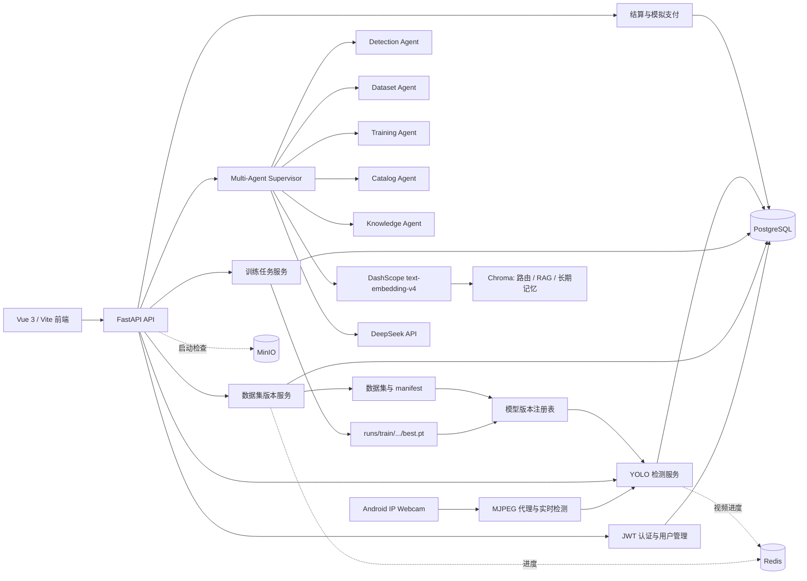
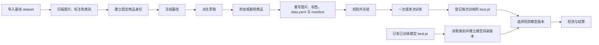
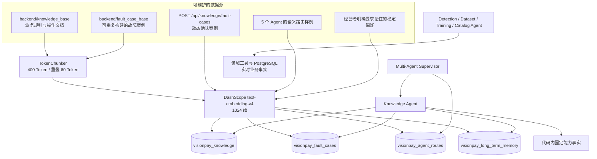

# VisionPay Agent Platform

VisionPay Agent Platform 是一个面向零售自助结算场景的商品视觉识别平台。系统以 YOLOv11 完成图片、视频和实时画面的商品检测，以 FastAPI 管理数据集、训练任务、模型版本、商品与价格，以 Vue 3 提供智能对话、数据集版本、模型训练、自助结算和运营管理界面。

当前版本已经形成完整的版本链路：

```text
模型版本
→ 训练任务
→ 数据集版本
→ class_index
→ 稳定 product_id / product_key
→ 商品名称、条码和价格
```

这条链路解决了数据集增删商品后类别编号变化、同一数据集重复训练、检测模型切换以及历史训练结果追溯等问题。

## 1. 核心功能

### 1.1 商品检测与智能对话

- 在 `/chat` 上传单张图片、多张图片或 ZIP，由 Detection Agent 执行检测。
- 支持通过聊天附件提交 MP4、AVI、MOV、MKV 视频并返回关键帧结果。
- Android IP Webcam MJPEG 实时检测、跨帧稳定和实时计价。
- 返回类别、置信度、边界框、标注图、推理耗时和商品价格汇总。
- Supervisor 采用“强意图规则 + DashScope/Chroma 语义候选”的双轨路由，将请求交给 Detection、Dataset、Training、Catalog 或 Knowledge Agent，并通过 SSE 流式返回结果。
- 所有领域 Agent 共用结构化参数问询卡；缺少任务参数时在聊天内一次性填写。Dataset Agent 的添加样品操作随后进入页面交接，由用户选择本地文件夹并逐图人工绘框。
- 保存检测会话、附件、任务历史和数据看板统计。

#### 多 Agent 架构与权限边界

多 Agent 仅面向已登录的后台经营者，统一从 `/chat` 进入；顾客可见的 `/checkout` 不接入 Agent、RAG 或长期记忆。Supervisor 负责路由、会话上下文和流式事件，各领域 Agent 只持有其职责范围内的工具：

| Agent | 职责与工具范围 |
| --- | --- |
| Detection Agent | 对聊天附件执行图片、批量图片或视频商品检测，并返回检测结果。 |
| Dataset Agent | 查询版本、查看详情、派生、冻结、归档，以及发起添加/删除样品的人工标注交接。 |
| Training Agent | 查询训练任务、日志和指标；发起训练启动、停止及默认模型切换的待确认操作。 |
| Catalog Agent | 查询价目表、缺价商品和条码；发起改价、清除价格的待确认操作。 |
| Knowledge Agent | 解释平台能力和通用概念，检索操作知识库与故障案例，并保存或召回经营者明确要求记住的稳定偏好。 |

Agent 不把知识库或记忆当作实时事实来源：数据集、训练、检测、价格等状态一律以领域工具返回的数据为准。涉及派生、冻结、归档、删除、训练控制、模型切换和改价等写操作时，系统会先展示影响范围预览；用户在卡片中确认后才执行。确认令牌为一次性且有时效，重复请求由幂等键返回首次结果；操作状态、参数、执行人和结果会记录到审计记录中。

当领域工具缺少具体参数时，Agent 必须调用统一的 `request_user_input_form`。Agent 只能提交操作标识 `purpose` 和已知默认值，标题、字段、顺序、文案与固定选项全部来自后端模板注册表，因此同一操作每次生成的表单结构一致。前端按模板 schema 渲染文本、数字、整数、单选、多选、开关和日期字段，并支持条件显示与默认值。每张表单具有会话内唯一 `form_id`；后端按原始 schema 校验提交值、拒绝重复提交，并强制返回发起表单的 Agent 继续处理。参数表单不替代高风险确认卡，也不承载文件上传、图片选取或检测框绘制。

#### Agent 路由规则

每条管理端消息都会调用阿里云百炼 `text-embedding-v4` 生成语义候选 Agent。候选结果是常规消息的首选路由，但不会覆盖以下可审计的强业务意图：

- 商品检测请求和附件检测；未完成的人工交接工作流。
- 数据集版本派生、冻结、归档，以及“添加/新增/增加商品、样品、训练图、训练集、标注”等数据集编辑动作。
- 启动、停止、查询进度或日志等训练任务操作；默认模型切换或发布。
- 价格查询、改价和清除价格。
- 平台架构、Agent 数量和各领域 Agent 的职责说明统一进入 Knowledge Agent。

例如，“向 `mutation-smoke-v2` 添加新的商品”即使上一轮错误地停留在 Training Agent，也会强制进入 Dataset Agent；“启动训练”则仍进入 Training Agent。强意图与语义候选不一致时，后端会记录路由覆盖日志。若 embedding 不可用或相似度低于阈值，系统会依次降级为关键词、未完成工作流、会话上下文和 Knowledge Agent 澄清。

### 1.2 数据集版本管理

- 导入已有 YOLO 数据集作为不可变基线。
- 导入已有已训练模型 `best.pt`，自动生成可用于检测和价目管理的模型目录版本，无需重新训练。
- 扫描 `data.yaml`、图片和 YOLO 标注，建立数据库索引与 `manifest.json`。
- 为商品建立跨版本稳定的 `product_id` 和 `product_key`。
- 从冻结版本派生可编辑草稿，不直接修改历史版本。
- 将样本添加拆分为“新商品训练图”“已有商品训练图”和“val/test 结账场景”三种模式。
- 所有检测框均由用户在图形化界面手工绘制，不再使用自动候选框。
- train 图片只标记一种商品的多个拍摄角度；val/test 场景可在一张图中标记多个已有商品。
- 搜索并删除商品的全部相关标注；单商品图片随之删除，多商品场景仍有其他有效框时保留，并自动重排后续 `class_index`。
- 校验、冻结、归档和删除草稿。
- 派生版本、添加样本、删除商品和删除草稿提供实时进度。

### 1.3 模型训练与版本选择

- 从已冻结的数据集版本启动 YOLOv11 训练。
- 展示 epoch、批次进度、日志、Loss、Precision、Recall 和 mAP。
- 支持停止任务、模型评估、测试图预测、结果下载和模型导出。
- 支持导入集群 `sbatch` 或其他离线 Ultralytics 训练结果。
- 每次成功训练的 `best.pt` 自动登记为独立模型版本。
- 同一数据集可以多次训练，每次训练保留独立参数、指标和权重路径。
- 在“模型训练”页面选择当前检测模型，图片、视频、实时检测和结算共用该选择。
- 兼容已有 `backend/best.pt`，自动登记为“正式版v1.0”。

### 1.4 商品价格与自助结算

- 管理商品名称、SKU、商品条码、单价和币种。
- 检测结果自动汇总数量、单价、小计和总价。
- 结算端允许调整数量或移除商品，服务端重新读取价格并计价。
- 缺价商品明确标记为未定价，不会被静默计入总价。
- 生成动态二维码，支持手机端模拟微信或支付宝付款。
- 保存订单状态和结算历史；模拟支付不会连接真实支付渠道或产生资金交易。

## 2. 系统架构



### 2.1 数据集、训练与检测关系



### 2.2 稳定商品身份与计价

`class_index` 是某个数据集版本内的 YOLO 类别编号，删除商品后可能变化，不能作为永久商品主键。系统使用以下规则保持商品身份稳定：

- `Product.id`：数据库内部稳定主键。
- `Product.product_key`：跨数据集版本使用的稳定业务键。
- 基线数据已有商品条码时，`product_key` 为 `barcode:<商品条码>`。
- 没有条码的基线商品使用场景、旧类别和类别名生成确定性的 UUIDv5。
- 新增商品提供条码时沿用 `barcode:<商品条码>`；不提供时生成 `prod:<UUID>`。
- 删除商品只会重排该数据集版本的 `class_index`，不会重写其他商品的 `product_id` 或 `product_key`。

新版训练模型的计价路径为：

```text
ModelVersion.dataset_version_id
→ DatasetClassMapping.class_index
→ Product.id
→ ProductPrice.product_id
```

未绑定数据集版本的兼容模型（例如“正式版v1.0”）无法恢复历史映射，因此使用旧规则 `category_id = class_id + 1` 查价。

### 2.3 知识库、故障案例与长期记忆架构

知识能力仅服务于已登录的后台经营者，不进入顾客结算端 `/checkout`。系统使用阿里云百炼 `text-embedding-v4` 生成 1024 维向量，使用本地 Chroma 和 Cosine 距离保存四类彼此隔离的数据。DeepSeek 负责理解、工具选择和回答生成；Embedding 只负责把文本转换成检索或路由所需的向量，不直接生成答案。



#### 数据源与目录

```text
backend/
├── knowledge_base/
│   ├── catalog/       # 价目、商品身份、币种精度与缺价处理（6 份）
│   ├── dataset/       # 数据集生命周期、版本操作、标注与校验（7 份）
│   ├── detection/     # 检测输入、参数、结果解释与误检漏检（7 份）
│   ├── general/       # 平台通用流程、安全确认、审计与操作边界（6 份）
│   └── training/      # 训练状态、参数、指标、远程训练与发布（7 份）
└── fault_case_base/   # 已确认且可重复构建的故障案例（8 份）
```

上述数量是当前版本的初始基准，不是代码限制。两个目录均递归扫描 `.md` 和 `.txt`；文档相对于根目录的一级目录名会写入 Chunk 的 `domain` 元数据，可用于领域过滤。原始文档随 Git 管理，生成后的 Chroma 数据位于项目根目录 `.runtime/chroma`，属于可重建运行时数据并被 Git 忽略。

#### Chroma 集合职责

| 集合 | 当前初始基准 | 写入来源 | 用途 |
| --- | ---: | --- | --- |
| `visionpay_knowledge` | 35 Chunk / 33 份文档 | `backend/knowledge_base/` | 稳定业务规则、操作流程、字段解释和排障方法的 RAG 检索 |
| `visionpay_fault_cases` | 8 Chunk / 8 份文档 | `backend/fault_case_base/`；确认案例 API | 检索与当前症状相似的历史故障和解决方案 |
| `visionpay_agent_routes` | 20 条样例 | 5 个 Agent 各 4 条语义样例 | 为 Supervisor 提供每条输入的 Embedding 路由候选 |
| `visionpay_long_term_memory` | 初始为 0 | Knowledge Agent 显式保存 | 按 `user_id` 隔离的经营者稳定偏好 |

集合计数会随文档、故障案例和用户记忆变化。长期记忆初始为 0 是正常状态；它不会在普通聊天中自动记录所有内容。

#### 索引构建与同步

`backend/tools/build_knowledge_index.py` 会构建业务知识、故障案例两个文档索引，并初始化语义路由集合。每次文档构建执行以下流程：

1. 递归扫描 `.md`、`.txt`，按配置执行 400 Token 切片和 60 Token 重叠。
2. 使用“相对路径 + Chunk 序号 + Chunk 内容”的 SHA-256 生成内容寻址 ID。
3. 批量调用 DashScope 生成向量，先 upsert 完整的新快照。
4. 新快照写入成功后，比较新旧 ID 并删除被修改或已删除文档遗留的陈旧 Chunk。
5. 只清理带有文档索引标记的记录，因此通过 `/api/knowledge/fault-cases` 动态写入的确认案例不会在重建时被误删。

内容寻址 ID 使未变化文档的重复构建保持幂等。先写后删也保证 Embedding 或写入失败时旧快照仍可检索，不会因一次失败重建而先清空线上索引。

#### Knowledge Agent 工具链

| 工具 | 数据来源 | 说明 |
| --- | --- | --- |
| `get_platform_agent_capabilities` | 代码内固定事实 | 回答 Agent 数量、职责和权限边界；不依赖 RAG，知识文档不能覆盖这些事实 |
| `search_management_knowledge` | `visionpay_knowledge` | 检索管理规则、操作流程和字段解释，可按 `domain` 过滤 |
| `search_fault_cases` | `visionpay_fault_cases` | 根据故障现象召回相似案例 |
| `remember_management_preference` | `visionpay_long_term_memory` | 仅在用户明确要求记住时保存稳定偏好，并绑定当前 `user_id` |
| `recall_management_memory` | `visionpay_long_term_memory` | 仅召回当前经营者自己的相关记忆 |

#### 数据边界与事实优先级

| 信息类型 | 正确来源 | 是否进入业务知识 RAG |
| --- | --- | --- |
| 稳定规则、操作步骤、字段含义、排障手册 | `knowledge_base` | 是 |
| 已确认故障现象与解决方案 | `fault_case_base` 或确认案例 API | 进入独立故障案例集合 |
| 当前数据集版本、训练状态、实时指标、默认模型、检测结果、商品价格 | 领域 Agent 工具与 PostgreSQL | 否，必须实时查询 |
| Agent 数量、职责和权限 | 代码内固定能力事实 | 否，避免文档过期覆盖运行时事实 |
| 用户明确要求保存的稳定偏好 | 按 `user_id` 隔离的长期记忆 | 进入独立记忆集合 |
| 密码、Token、实时价格、临时任务状态 | 不保存 | 否 |

当检索结果与领域工具冲突时，以领域工具的实时返回为准。RAG 不直接执行派生、冻结、归档、删除、启动训练、切换模型或改价等写操作；这些操作仍必须经过参数表单、影响范围预览、一次性确认令牌、幂等保护和操作审计。

### 2.4 技术栈

| 层级 | 技术 |
| --- | --- |
| 前端 | Vue 3、Vite 8、Element Plus、Pinia、Axios、ECharts、Vitest |
| 后端 | FastAPI、SQLAlchemy 2、Alembic、Pydantic 2 |
| 训练与推理 | Ultralytics YOLOv11、PyTorch、OpenCV、Pillow |
| 智能体 | LangChain、LangGraph、DeepSeek OpenAI-compatible API、DashScope `text-embedding-v4` |
| 向量检索 | 本地 Chroma（Cosine）：模糊路由、知识库、故障案例、长期记忆 |
| 数据与基础设施 | PostgreSQL 15、Pgvector、Redis 7、MinIO、Docker Compose |

## 3. 项目目录

```text
agent-platform/
├── backend/
│   ├── alembic/                  # 数据库迁移
│   ├── app/
│   │   ├── agent/                # DeepSeek Detection Agent
│   │   ├── api/                  # FastAPI 路由
│   │   ├── config/               # 环境配置
│   │   ├── core/                 # 日志、鉴权和异常处理
│   │   ├── database/             # SQLAlchemy 会话
│   │   ├── entity/               # ORM 与 Pydantic 模型
│   │   ├── services/             # 检测、数据集、模型和业务服务
│   │   ├── storage/              # Redis 进度与 MinIO 客户端
│   │   └── training/             # YOLO 训练、转换和拆分工具
│   ├── dataset_versions/         # 托管数据集版本，默认被 Git 忽略
│   ├── datasets/                 # 本地原始/测试数据集，默认被 Git 忽略
│   ├── knowledge_base/           # 可版本管理的业务知识源文档
│   ├── fault_case_base/          # 可版本管理的已确认故障案例
│   ├── runs/                     # 训练、检测和评估产物，默认被 Git 忽略
│   ├── tests/                    # Pytest 测试
│   ├── tools/                    # 场景、价格和数据集辅助脚本
│   ├── best.pt                   # 兼容正式模型，不提交 Git
│   ├── main.py                   # FastAPI 入口
│   └── requirements.txt
├── frontend/
│   ├── src/api/                  # API 客户端
│   ├── src/components/           # 通用、布局和检测框编辑组件
│   ├── src/stores/               # Pinia 状态
│   ├── src/views/                # 页面
│   ├── tests/                    # Vitest 测试
│   ├── package.json
│   └── vite.config.js
├── .runtime/                     # 上传、暂存和日志等运行时文件
├── docker-compose.yml            # PostgreSQL、Redis、MinIO
└── README.md
```

数据集、模型权重、训练输出、检测输出、`.env`、日志和商品元数据 JSON 都属于运行数据，不随 Git 仓库分发。

## 4. 数据模型与状态

| 模型 | 作用 |
| --- | --- |
| `DetectionScene` | 隔离场景的类别、数据集、训练任务和默认模型 |
| `DatasetVersion` | 记录数据集路径、父版本、状态、计数、内容指纹和校验结果 |
| `Product` | 保存稳定商品身份、名称和条码 |
| `DatasetClassMapping` | 保存某数据集版本内 `class_index` 到稳定商品的映射 |
| `DatasetImage` / `DatasetAnnotation` | 数据集图片与检测框索引 |
| `TrainingTask` / `TrainingMetric` | 保存训练配置、进度和逐 epoch 指标 |
| `ModelVersion` | 关联权重文件、训练任务和数据集版本，并标记场景默认模型 |
| `ProductPrice` | 保存商品价格，优先通过 `product_id` 关联 |
| `DetectionTask` / `DetectionResult` | 保存检测历史与结果 |
| `MockPaymentOrder` | 保存模拟支付订单和状态 |

数据集版本状态：

- `draft`：可修改，只允许派生草稿执行商品增删。
- `pending_train`：已校验并冻结，等待训练，可设为当前或作为派生源。
- `training`：已有训练任务正在运行，数据集内容仍保持冻结。
- `published`：已经产生可用的活动模型，可用于检测、计价或继续派生。
- `archived`：历史冻结版本，不能设为当前，但可追溯或导入离线训练结果。

训练状态包括 `pending`、`running`、`completed`、`failed`、`cancelled`。数据集列表会汇总为未训练、排队中、训练中、已训练或失败。

## 5. 环境要求

| 工具 | 建议版本 | 说明 |
| --- | --- | --- |
| Python | 3.10 或 3.11 | 后端、训练和测试 |
| Node.js | 20.19+ 或 22.12+ | Vite 8 要求 |
| Docker Desktop / Docker Engine | 24+ | 启动基础服务 |
| Docker Compose | 2+ | 使用 `docker compose` |
| NVIDIA 驱动与 CUDA | 可选 | GPU 训练和推理；CPU 也可运行 |

下文以 Windows PowerShell 为主。Linux/macOS 只需将虚拟环境激活命令换为 `source .venv/bin/activate`，并使用对应路径格式。

## 6. 本地安装与启动

### 6.1 克隆仓库

```powershell
git clone https://github.com/Azar233/agent-platform
cd agent-platform
```

### 6.2 启动基础服务

```powershell
docker compose up -d postgres redis minio
docker compose ps
```

默认端口：

| 服务 | 地址 |
| --- | --- |
| PostgreSQL | `localhost:5432` |
| Redis | `localhost:6379` |
| MinIO API | `localhost:9000` |
| MinIO Console | `http://localhost:9001` |

PostgreSQL 是必需依赖。Redis 用于视频和耗时数据集操作的跨进程进度，连接失败时会降级为当前后端进程的内存缓存。MinIO 当前用于对象存储基础设施和健康检查；启动失败不会阻止 FastAPI 启动，但详细健康检查会报告异常。

### 6.3 安装后端

```powershell
conda activate agentenv
cd backend
python -m pip install --upgrade pip
python -m pip install -r requirements.txt
Copy-Item .env.example .env
```

如未使用 Conda，可用 `python -m venv .venv` 创建环境并执行 `.\.venv\Scripts\Activate.ps1`；后续所有 `python`、`alembic` 与 `uvicorn` 命令必须在同一个已激活环境中执行，不能与 `agentenv` 混用。

至少检查 `backend/.env`：

```env
DB_HOST=localhost
DB_PORT=5432
DB_NAME=vp_agent
DB_USER=vp_admin
DB_PASSWORD=vp_admin

JWT_SECRET_KEY=replace-with-a-long-random-secret

DETECTION_MODEL_PATH=

REDIS_HOST=localhost
REDIS_PORT=6379
MINIO_ENDPOINT=localhost:9000
MINIO_ACCESS_KEY=minioadmin
MINIO_SECRET_KEY=minioadmin
MINIO_BUCKET=vp-images

DEEPSEEK_API_KEY=sk-your-deepseek-api-key
DEEPSEEK_BASE_URL=https://api.deepseek.com
DEEPSEEK_MODEL=deepseek-chat
```

`DETECTION_MODEL_PATH` 没有兼容模型时应保持为空，避免指向不存在的占位路径。`DEEPSEEK_API_KEY` 只影响智能对话，普通检测、数据集、训练和结算功能不依赖它。数据库连接统一由 `DB_HOST`、`DB_PORT`、`DB_NAME`、`DB_USER`、`DB_PASSWORD` 组装。

多 Agent 路由的全量语义候选、知识库、故障案例和长期记忆使用阿里云百炼 `text-embedding-v4` 与本地 Chroma。强业务意图仍由确定性规则覆盖，避免语义相似度改变高风险管理操作的归属：

```env
DASHSCOPE_API_KEY=你的百炼API-Key
DASHSCOPE_BASE_URL=https://dashscope.aliyuncs.com/compatible-mode/v1
EMBEDDING_MODEL=text-embedding-v4
EMBEDDING_DIMENSIONS=1024
EMBEDDING_BATCH_SIZE=10
CHROMA_PERSIST_DIR=../.runtime/chroma
CHROMA_DISTANCE=cosine
RAG_CHUNK_TOKENS=400
RAG_CHUNK_OVERLAP_TOKENS=60
RAG_TOP_K=5
ROUTER_MIN_SIMILARITY=0.42
# hybrid 为生产默认；embedding_only 会跳过强意图、关键词、附件和会话上下文保护，仅用于测试。
AGENT_ROUTING_MODE=hybrid
LONG_TERM_MEMORY_TOP_K=3
AGENT_HANDOFF_TTL_SECONDS=86400
AGENT_CONFIRMATION_TTL_SECONDS=600
```

DashScope、Embedding、Chroma、RAG、路由和记忆参数统一从 `backend/.env` 读取；不要再通过 `setx` 单独维护同名配置。`backend/.env` 已被 Git 忽略，提交时只维护不含真实密钥的 `.env.example`。修改 `.env` 后需要重启后端。首次构建知识库时，脚本会同时写入知识库索引并预热向量路由示例：

```powershell
conda activate agentenv
cd backend
python tools/build_knowledge_index.py
```

待检索的操作文档放在 `backend/knowledge_base/`，可重复构建的已确认故障案例放在 `backend/fault_case_base/`（均支持 `.md`、`.txt`，一级子目录会成为领域标签）。新增、修改或删除文档后再次执行上述脚本；同步算法、集合职责和数据边界见 [2.3 知识库、故障案例与长期记忆架构](#23-知识库故障案例与长期记忆架构)。Chroma 数据保存在项目根目录 `.runtime/chroma`，不会提交到 Git。Embedding 不可用时，路由会自动降级为强意图、关键词、未完成工作流和会话上下文；知识库与长期记忆则返回不可用提示，不会阻塞检测、数据集、训练、价目表或结算业务。训练可以在其他机器或集群执行；管理端的 Training Agent 通过数据库任务、日志和指标进行监控，不要求当前后端机器具备 CUDA 训练环境。

除命令行脚本外，登录后还可以通过以下管理 API 构建、检查和检索知识能力：

| 方法 | 路径 | 作用 |
| --- | --- | --- |
| `GET` | `/api/knowledge/status` | 查看 Embedding 配置、切片参数及四个 Chroma 集合的计数 |
| `POST` | `/api/knowledge/build` | 同步构建业务知识与可重复构建的故障案例索引 |
| `POST` | `/api/knowledge/search` | 检索业务知识，可指定 `domain` 和 `top_k` |
| `POST` | `/api/knowledge/fault-cases` | 写入人工确认的动态故障案例 |
| `POST` | `/api/knowledge/memory/search` | 按当前登录用户检索长期记忆 |

这些接口均要求登录认证。长期记忆的写入由对话内 Knowledge Agent 的 `remember_management_preference` 工具完成，当前没有开放通用的记忆写入 HTTP 接口。

如需单独评估向量路由，可在 `backend/.env` 临时设置 `AGENT_ROUTING_MODE=embedding_only` 后重启后端。该模式跳过强意图、关键词、附件、未完成工作流和会话上下文保护，最终 Agent 仅由 embedding 相似度决定；Embedding 不可用或低于阈值时安全返回 Knowledge Agent。测试结束必须改回 `AGENT_ROUTING_MODE=hybrid`。

### 6.4 执行数据库迁移

在 `backend` 目录和已激活的虚拟环境中执行：

```powershell
python -m alembic upgrade head
python -m alembic current
```

当前迁移链已经合并数据集版本和支付功能的历史分支。新环境必须执行到唯一 head；不要使用 ORM `create_all` 代替 Alembic 迁移。

### 6.5 创建检测场景

数据集、训练和模型都属于某个 `DetectionScene`。可从 YOLO `data.yaml` 读取类别：

```powershell
python tools\create_scene.py `
  --name vision_pay `
  --display-name "VisionPay 零售结算" `
  --category retail `
  --data-yaml "D:\datasets\vision_pay\data.yaml"
```

也可以直接传递类别：

```powershell
python tools\create_scene.py `
  --name demo `
  --display-name "本地演示" `
  --class-names "cola,chips,bread"
```

脚本会输出 `scene_id`，导入数据集和训练时需要使用它。再次以相同 `--name` 执行会更新场景；加 `--no-update` 可禁止更新，加 `--dry-run` 可只校验不写数据库。

### 6.6 准备兼容正式模型

如需保留仓库原有检测模型，将权重放在：

```text
backend/best.pt
```

后端发现该文件后，会为每个活动场景登记“正式版v1.0”，第一次登记时保持它为默认检测模型。它没有可恢复的数据集版本和训练参数，因此界面会显示为旧版/未绑定数据集，并使用兼容价格映射。

`DETECTION_MODEL_PATH` 只是没有已选模型版本时的兼容后备。修改模型文件或 `.env` 后应重启后端。

### 6.7 初始化旧 RPC 商品价格（可选）

旧 200 类 RPC 基线可将包含 `__raw_Chinese_name_df` 的 `instances_train2019.json` 放在项目根目录，然后执行：

```powershell
python tools\init_prices.py
```

该文件被 Git 忽略，脚本可重复执行。脚本内价格是演示价格，不代表真实市场价格。新增商品会在确认写入数据集时直接创建或更新其 `ProductPrice`，不依赖这个 JSON。

### 6.8 启动后端

```powershell
uvicorn main:app --host 0.0.0.0 --port 8000 --reload
```

- API 根地址：`http://127.0.0.1:8000`
- 健康检查：`http://127.0.0.1:8000/api/health`
- 详细健康检查：`http://127.0.0.1:8000/api/health/detail`
- Swagger：`http://127.0.0.1:8000/docs`
- ReDoc：`http://127.0.0.1:8000/redoc`

登录后可在 Swagger 中授权并调用 `GET /api/knowledge/status` 验证向量能力：`embedding_configured` 应为 `true`，模型应为 `text-embedding-v4`，维度应为 `1024`，距离类型应为 `cosine`。完成首次索引后，`visionpay_knowledge`、`visionpay_fault_cases` 和 `visionpay_agent_routes` 的集合计数应大于 0；`visionpay_long_term_memory` 在尚未保存任何用户偏好时可以为 0。若接口返回 `error`，应先检查 `backend/.env`、DashScope 网络连通性和 `.runtime/chroma` 的写入权限。

### 6.9 安装并启动前端

打开另一个 PowerShell：

```powershell
cd frontend
npm install
Copy-Item .env.example .env
npm run dev
```

访问 `http://127.0.0.1:5173`。Vite 监听 `0.0.0.0:5173`，开发环境将 `/api/*` 代理到 `http://localhost:8000`。

手机扫码访问模拟支付页时，Vite 会自动选择本机局域网 IPv4。自动选择不正确时，在 `frontend/.env` 设置：

```env
VITE_CHECKOUT_PUBLIC_ORIGIN=http://192.168.1.100:5173
```

`frontend/.env.example` 中的 `VITE_API_BASE_URL`、`VITE_APP_TITLE` 和 `VITE_MINIO_URL` 当前未被前端运行代码读取；API 客户端固定使用同源 `/api`。

## 7. 数据集准备与版本管理

### 7.1 输入数据集格式

基线必须是后端可访问的 YOLO 检测数据集：

```text
dataset-root/
├── data.yaml
├── images/
│   ├── train/
│   ├── val/
│   └── test/
└── labels/
    ├── train/
    ├── val/
    └── test/
```

标签每行格式为：

```text
class_index x_center y_center width height
```

坐标均为 0 到 1 的 YOLO 归一化值。`data.yaml` 必须包含连续的 `names`，且 `nc` 与类别数量一致。

当前样本语义为：

- `train`：单商品图片，同一批次只允许一种商品，用于补充不同拍摄角度。
- `val/test`：模拟真实结账的多商品场景，一张图可以包含多个不同商品。
- val/test 中每个检测框都必须选择当前数据集 train 中已经有标注的商品；未知商品必须先补充 train 样本。

### 7.2 导入基线

登录后进入“数据集版本”，点击“导入基线 dataset”：

1. 填写场景 ID、源目录、版本号和名称。
2. “源目录”是后端机器看到的路径，不是浏览器上传路径。
3. 建议启用“复制为托管版本”，系统会复制到 `DATASET_VERSION_ROOT/scene_<id>/<version>`。
4. 根据需要启用“设为当前”。
5. 提交后系统读取类别、建立商品与类别映射、扫描图片/标签、写入 `manifest.json`、计算内容指纹并冻结基线。

导入基线时，为兼容旧 RPC 数据，初始 `category_id` 使用 `class_index + 1`。这只是首次连接历史价格的兼容字段，后续身份以 `product_id/product_key` 为准。

如果只有已经训练完成的 `best.pt`、没有训练数据集，不需要伪造基线目录。请使用页面右上角的“导入可用模型”，具体方法见 [8.4 导入已有已训练模型](#84-导入已有已训练模型bestpt)。

### 7.3 派生草稿

在已冻结或已归档版本的“操作”中选择“派生版本”，填写新版本号、名称和说明。系统复制父版本文件与全部商品映射，并创建 `draft`。复制和重新扫描过程通过进度对话框实时显示。

不要直接在已冻结目录中修改文件。所有商品增删都应在派生草稿上完成，才能保证训练和历史检测可追溯。

### 7.4 添加样本

在派生草稿的“操作”中点击“添加样本”，然后选择一种模式。

“新建商品训练图”：

1. 填写商品名称、类别名称和价格，商品条码可选。
2. 选择非空 train 文件夹；每张图片只能出现当前这一种商品，但可以包含不同角度或多个同类实例。
3. 点击“下一步”后逐张手工绘制普通矩形框并确认。
4. 提交后创建稳定 `product_id/product_key`、类别映射和价格，并写入 train 图片与标签。

“已有商品训练图”：

1. 从当前数据集商品目录中搜索并选择商品。
2. 选择非空 train 文件夹。
3. 为每张图片手工绘制该商品的全部检测框并确认。
4. 提交后只追加训练样本，不创建新类别，也不修改稳定商品身份。

“val/test 结账场景”：

1. 选择 val 和/或 test 文件夹，至少一个文件夹非空。
2. 在每张多商品图片上手工绘制所有检测框。
3. 为每个框选择对应的已有商品。
4. 如果某商品不在当前数据集 train 标注中，后端拒绝提交；应先通过前两种模式补充该商品训练图。
5. 提交后按所选商品的 `class_index` 写入多类别 YOLO 标签。

系统不再自动生成检测框，也不会自动拆分 train、val、test。当前冻结校验仍要求整个数据集的三个分区都至少有图片和标注。

### 7.5 删除商品

在派生草稿的“操作”中点击“删除商品”：

1. 按 `product_id`、`product_key`、`class_id`、类别名或商品名搜索。
2. 确认目标商品。
3. 系统删除该商品对应的全部标注；标签清空的单商品图片会一并删除。若 val/test 场景仍包含其他商品框，图片会保留，只移除目标商品框。
4. 大于被删类别的 `class_index` 自动减一，相关标签、`data.yaml` 和清单同步重写。
5. 默认将商品标记为停用，但稳定 ID 不会分配给其他商品。

删除会修改实际数据文件且不可在当前草稿内自动撤销；需要恢复时应删除草稿并从父版本重新派生。

### 7.6 校验、冻结与归档

编辑完成后按顺序执行：

1. “校验”检查类别数量、连续 `class_index`、稳定商品映射、分区计数和内容指纹。
2. 本地或共享挂载目录可启用文件系统检查，确认目录、`data.yaml` 和 `manifest.json` 存在。
3. “冻结”将 `draft` 变为 `pending_train`，冻结后不能继续增删商品。
4. 当前版本在导入基线或导入可用模型时指定；数据集列表不提供手动“设为当前”操作。
5. 不再使用的冻结版本可以归档；当前模型目录归档时会自动切换可用的检测模型和数据集版本。

只有草稿可以删除；存在派生关系或训练关联时，服务端会保护相关记录。

### 7.7 按数据集版本管理价目表

进入“价目表管理”后必须先选择一个已注册的数据集版本。页面只展示该版本 `DatasetClassMapping` 中已经存在的商品，不能在价目表页面新增商品，也不提供批量删除：

1. 按场景、版本号或名称搜索并选择数据集版本。
2. 按商品名、条码、`product_id` 或 `product_key` 搜索版本内商品。
3. 编辑已有价格，或为版本中已有但尚未定价的商品补充价格。
4. “清除价格”只删除 `ProductPrice`，不会删除稳定商品、类别映射、图片或标注。

价格通过稳定 `product_id` 关联，因此同一个商品出现在多个数据集版本时，这些版本会共同使用更新后的价格。商品种类的新增和删除仍必须在“数据集版本”页面的派生草稿中完成。

## 8. 模型训练与模型版本

### 8.1 启动训练

进入“模型训练”，选择场景和已冻结的数据集版本，再配置：

- 基础模型：`yolov11n/s/m/l/x` 或对应 `.pt` 名称。
- Epoch、图像尺寸、全局 batch size。
- 设备：`cpu`、`0`、`0,1` 或 `0-7`。
- 优化器、初始学习率和数据增强参数。

未显式选择数据集时，后端优先使用该场景当前且已冻结的数据集（`pending_train`、`training` 或 `published`）；仍没有注册版本时才兼容查找 `backend/datasets/vision_pay`、场景目录或请求中指定的 `data.yaml`。

训练在后端进程的后台线程运行，输出目录为：

```text
backend/runs/train/task_<task_uuid>/
├── args.yaml
├── results.csv
├── weights/
│   ├── best.pt
│   └── last.pt
└── ...
```

训练任务会保存数据集版本 ID 和训练时的 `content_hash` 快照。成功完成且存在 `weights/best.pt` 时，系统自动创建模型版本“训练-<task_uuid>”。

### 8.2 训练监控与结果操作

训练页面支持：

- 查询当前 epoch、batch、百分比、速度、耗时与预计剩余时间。
- 查看训练日志和逐 epoch 指标曲线。
- 停止运行中的任务。
- 使用 train、val 或 test 分区评估 `best.pt`。
- 上传单张测试图进行预测。
- 下载权重和 `results.csv`。
- 导出模型版本并填写版本说明。

### 8.3 集群离线训练结果导入

Web 后台线程适合单机开发。集群生产环境建议由调度系统运行 Ultralytics，再在训练页面导入运行目录。运行目录至少需要：

```text
run-dir/
├── results.csv
├── args.yaml              # 推荐
├── train.log              # 可选
└── weights/
    ├── best.pt            # completed 任务登记模型版本所需
    └── last.pt            # 可选
```

导入时选择实际使用的数据集版本，并提供集群节点对后端可见的 `run_dir`。系统读取 `args.yaml` 和 `results.csv`，导入训练参数、指标和日志；状态为 `completed` 且存在 `best.pt` 时自动登记模型版本。

如果运行目录不在标准 `TRAIN_OUTPUT_DIR/task_<uuid>` 下，服务会尝试创建指向外部目录的符号链接。Linux 集群通常可直接使用；Windows 需要开发者模式或创建符号链接的权限。

### 8.4 导入已有已训练模型（best.pt）

不需要在本系统训练、只有现成 YOLO 检测权重的用户，可以在“数据集版本”页面右上角点击“导入可用模型”。这里的“可用模型”表示权重已经能够直接推理，并且系统能够从权重中恢复类别目录。

导入步骤：

1. 填写模型所属场景 ID、版本号和显示名称。
2. 选择一种来源：
   - “上传 best.pt”：从浏览器选择并上传权重文件。
   - “服务器文件路径”：填写后端所在机器能够访问的绝对路径，例如 `D:\models\best.pt` 或 `/opt/models/best.pt`。浏览器和后端在同一台电脑时，这就是本机路径。
3. 根据需要勾选“设为当前数据集版本”和“设为当前检测模型”。对于完全没有版本的新场景，即使取消勾选，系统也会保证至少存在一个当前数据集和默认检测模型。
4. 点击“开始导入”。系统加载权重并读取其中的连续 `names` 类别表，然后自动完成：
   - 将权重复制到 `DATASET_VERSION_ROOT/scene_<scene_id>/<version>/best.pt`，原始文件之后可以移动或删除。
   - 生成只包含类别目录的 `data.yaml` 与 `manifest.json`。
   - 为每个 `class_index` 创建或复用稳定 `Product`、`product_id` 和 `product_key`。
   - 创建状态为 `published` 的“模型目录”数据集版本，并登记与它一一关联的 `ModelVersion`。
5. 进入“价目表管理”，选择刚导入的模型目录版本，为类别补充商品名称、条码和价格。
6. 在“模型训练”页面确认该模型已出现在检测版本列表；图片、视频、实时检测和结算会使用当前检测模型。

模型目录版本不包含 train、val、test 图片和标注，因此不会出现在“可训练数据集版本”列表中，但可以正常用于检测、模型切换和价目管理。如果后续需要补充训练数据，可从该版本派生草稿，再按数据集流程添加 train 与 val/test 样本。

导入时仅支持 Ultralytics 能够加载的 YOLO 目标检测 `.pt` 文件，并要求权重内置非空、从 0 连续排列的类别名称。模型文件会被加载解析，请只导入来源可信的权重。上传大小由 `MODEL_IMPORT_MAX_FILE_MB` 控制。

这与“导入离线训练结果”不同：离线训练结果导入要求完整 `run_dir`，用于恢复训练参数、指标和日志；“导入可用模型”只需要 `best.pt`，用于没有训练运行目录的部署场景。

### 8.5 选择检测模型

“模型训练”页面的模型版本板块展示：

- 模型版本和权重路径。
- 关联的数据集版本与内容指纹。
- 训练任务、参数、完成时间和指标。
- 文件是否仍存在。
- 当前是否为场景默认检测模型。

点击设为当前前，后端会确认权重文件存在。模型解析优先级为：

1. 数据库中该场景 `is_default=true` 且 `status=active` 的 `ModelVersion`。
2. `DETECTION_MODEL_PATH` 兼容后备。
3. 该场景最新完成训练任务的 `runs/train/task_<uuid>/weights/best.pt`。
4. 都不存在时返回明确错误。

一旦数据库已经选中模型版本，其文件缺失会直接报错，不会静默切换到另一模型。不要移动或清理仍在注册表中使用的 `best.pt`。

## 9. 检测、结算与支付使用方法

### 9.1 智能对话 `/chat`

配置 DeepSeek 后，可上传一张或多张图片、ZIP 或视频并用自然语言描述任务。Supervisor 会把明确的检测请求交给 Detection Agent；Agent 通过内部检测服务执行单图、批量、ZIP 或视频检测，经 SSE 返回结果，并保存会话、附件和检测任务记录。检测前缺少置信度或 IoU 时，Agent 会调用统一参数问询表单。

原 `/detection` 检测工作台及其专用单图、批量、ZIP、异步视频 HTTP 接口已经移除；后台经营者统一通过 `/chat` 使用检测能力。

### 9.2 用户结算端 `/checkout`

1. 使用图片上传或 IP Webcam 获取商品清单。
2. 检查商品数量、单价和缺价提示。
3. 修改数量或删除误检商品，后端按当前模型版本重新计价。
4. 价格完整后创建模拟支付订单。
5. 手机扫描二维码打开公开的 `/mock-pay/:token` 页面并确认模拟付款。
6. 收银端轮询订单状态并显示支付结果。

订单携带 `model_version_id`，确保修改数量后的计价仍使用检测时对应的数据集类别映射。

### 9.3 IP Webcam

1. 手机和后端机器连接同一局域网。
2. Android IP Webcam 启动服务，确认电脑能访问 `http://手机IP:端口/video`。
3. 在前端填写基础地址，例如 `http://192.168.1.20:8080`。
4. 后端只接受安全的局域网 HTTP 地址，并代理 MJPEG 流与实时推理结果。

实时检测使用目标稳定器减少短暂漏检和画面抖动。CPU 环境可降低 `CAMERA_IMAGE_SIZE` 或 `CAMERA_TARGET_FPS`。

## 10. 环境变量

### 10.1 应用、数据库与日志

| 变量 | 默认值 | 说明 |
| --- | --- | --- |
| `APP_NAME` | `Vision Pay` | 应用名称 |
| `APP_VERSION` | `0.1.0` | 应用版本 |
| `DEBUG` | `true` | 调试模式 |
| `DB_HOST` | `localhost` | PostgreSQL 主机 |
| `DB_PORT` | `5432` | PostgreSQL 端口 |
| `DB_NAME` | `vp_agent` | 数据库名 |
| `DB_USER` | `vp_admin` | 数据库用户 |
| `DB_PASSWORD` | `vp_admin` | 数据库密码 |
| `LOG_LEVEL` | `INFO` | 日志级别 |
| `LOG_DIR` | `../.runtime/backend-logs` | 后端日志目录，相对 `backend` |
| `LOG_MAX_BYTES` | `10485760` | 单个日志文件上限 |
| `LOG_BACKUP_COUNT` | `5` | 轮转日志保留数 |
| `SQL_ECHO` | `false` | 是否输出 SQL |

### 10.2 数据集与训练

| 变量 | 默认值 | 说明 |
| --- | --- | --- |
| `TRAIN_OUTPUT_DIR` | `runs/train` | 训练输出目录，相对 `backend` |
| `DATASET_BASE_DIR` | `datasets` | 兼容数据集根目录 |
| `DATASET_VERSION_ROOT` | `dataset_versions` | 托管版本根目录 |
| `DATASET_STAGING_ROOT` | `../.runtime/dataset-staging` | 检测框审核暂存目录 |
| `DATASET_STAGING_TTL_SECONDS` | `3600` | 暂存图片有效期 |
| `DATASET_OPERATION_TTL_SECONDS` | `3600` | 耗时操作进度有效期 |
| `DATASET_MAX_UPLOAD_MB` | `20` | 单张新增商品图片上限 |
| `DATASET_MAX_BATCH_SIZE` | `500` | 单次新增商品图片总数上限 |
| `YOLO_CONFIG_DIR` | `.ultralytics` | Ultralytics 配置目录 |

### 10.3 检测与视频

| 变量 | 默认值 | 说明 |
| --- | --- | --- |
| `DETECTION_MODEL_PATH` | 空 | 未选模型版本时的兼容权重路径 |
| `DETECTION_OUTPUT_DIR` | `runs/detect` | 检测输出目录 |
| `DETECTION_UPLOAD_DIR` | `.runtime/uploads` | 检测上传暂存目录，相对 `backend` |
| `DETECTION_MAX_FILE_MB` | `20` | 单张检测图片上限 |
| `DETECTION_MAX_BATCH_SIZE` | `30` | 单次图片批量上限 |
| `DETECTION_VIDEO_MAX_FILE_MB` | `50` | 视频文件上限 |
| `MODEL_IMPORT_MAX_FILE_MB` | `1024` | 上传已有已训练模型 `best.pt` 的文件上限 |
| `VIDEO_FRAME_SAMPLE_RATE` | `5` | 视频采样帧间隔 |
| `VIDEO_MAX_KEY_FRAMES` | `50` | 视频最大关键帧数 |
| `VIDEO_TASK_TTL_SECONDS` | `3600` | 视频进度有效期 |
| `VIDEO_RESULT_DIR` | `runs/detect/video-results` | 视频完整结果目录 |

### 10.4 IP Webcam

| 变量 | 默认值 | 说明 |
| --- | --- | --- |
| `IP_WEBCAM_URL` | `http://10.172.52.70:8080` | 默认手机摄像头地址，前端可覆盖 |
| `CAMERA_CONFIDENCE` | `0.30` | 实时检测置信度 |
| `CAMERA_IOU` | `0.45` | 实时检测 NMS IoU |
| `CAMERA_IMAGE_SIZE` | `512` | 推理输入尺寸 |
| `CAMERA_TARGET_FPS` | `3` | 目标检测帧率 |
| `CAMERA_JPEG_QUALITY` | `62` | 输出 JPEG 质量 |
| `CAMERA_OUTPUT_MAX_WIDTH` | `960` | 前端画面最大宽度 |
| `CAMERA_READ_TIMEOUT_MS` | `2000` | MJPEG 读取超时 |
| `CAMERA_STALE_TIMEOUT_SECONDS` | `5` | 画面过期时间 |
| `CAMERA_STABILITY_MIN_HITS` | `2` | 稳定目标最少连续命中数 |
| `CAMERA_STABILITY_MAX_MISSES` | `2` | 稳定目标允许漏检数 |
| `CAMERA_STABILITY_IOU` | `0.25` | 跨帧目标匹配 IoU |

### 10.5 Agent、认证和基础服务

| 变量 | 默认值 | 说明 |
| --- | --- | --- |
| `DEEPSEEK_API_KEY` | 空 | 智能对话必需 |
| `DEEPSEEK_BASE_URL` | `https://api.deepseek.com` | OpenAI-compatible 地址 |
| `DEEPSEEK_MODEL` | `deepseek-chat` | DeepSeek 模型标识 |
| `DEEPSEEK_TEMPERATURE` | `0.1` | Agent 温度 |
| `REDIS_HOST` | `localhost` | Redis 主机 |
| `REDIS_PORT` | `6379` | Redis 端口 |
| `MINIO_ENDPOINT` | `localhost:9000` | MinIO 地址 |
| `MINIO_ACCESS_KEY` | `minioadmin` | MinIO Access Key |
| `MINIO_SECRET_KEY` | `minioadmin` | MinIO Secret Key |
| `MINIO_BUCKET` | `vp-images` | Bucket 名称 |
| `MINIO_SECURE` | `false` | 是否使用 HTTPS |
| `JWT_SECRET_KEY` | 示例值 | JWT 密钥，生产环境必须替换 |
| `JWT_ALGORITHM` | `HS256` | JWT 算法 |
| `ACCESS_TOKEN_EXPIRE_MINUTES` | `30` | 登录令牌有效期 |
| `MOCK_PAYMENT_EXPIRE_MINUTES` | `10` | 模拟支付订单有效期 |
| `ALLOWED_ORIGINS` | 本地地址列表 | 逗号分隔的 CORS 白名单 |

## 11. API 概览

除健康检查、注册登录和公开模拟支付页外，业务接口通常需要：

```http
Authorization: Bearer <JWT>
```

| 前缀 | 功能 |
| --- | --- |
| `/api/auth` | 注册、登录、当前用户 |
| `/api/user` | 资料、密码、用户与角色 |
| `/api/datasets` | 数据集版本、商品增删、检测框审核和操作进度 |
| `/api/training` | 训练、日志、指标、验证、导出和模型版本选择 |
| `/api/detection/camera` | 顾客结算端使用的 IP Webcam 实时检测 WebSocket |
| `/api/camera` | IP Webcam 配置与代理流 |
| `/api/chat` | Agent 状态、会话、附件和 SSE 对话 |
| `/api/prices` | 按数据集版本查看、更新或清除已有商品价格 |
| `/api/checkout` | 结算检测与重新计价 |
| `/api/mock-pay` | 模拟支付订单、确认、状态和历史 |
| `/api/history` | 检测任务历史 |
| `/api/dashboard` | 业务统计与分布 |
| `/api/health` | 基础与详细健康检查 |

请求字段、响应结构和可调参数以运行中的 Swagger `/docs` 为准。

## 12. 测试与构建

### 12.1 后端测试

```powershell
cd backend
.\.venv\Scripts\Activate.ps1
python -m pytest -q
```

测试使用独立测试配置和 fixture，覆盖认证、检测、视频、实时稳定、价格、结算、模拟支付、数据集工作区、训练和健康检查。

### 12.2 前端测试

```powershell
cd frontend
npm run test:run
```

开发时监听测试：

```powershell
npm test
```

生成覆盖率：

```powershell
npm run test:coverage
```

### 12.3 前端生产构建

```powershell
cd frontend
npm run build
npm run preview
```

构建产物位于 `frontend/dist`。生产部署需要让 Web 服务器托管该目录，并将同源 `/api` 反向代理到 FastAPI；Vue Router 使用 history 模式，未知前端路径应回退到 `index.html`。

本仓库的 `docker-compose.yml` 只启动 PostgreSQL、Redis 和 MinIO，不包含前后端生产镜像。

## 13. 集群部署与真实数据注册

仓库内 `backend/datasets` 的数据只用于本地流程验证，不代表真实训练数据。真实数据集位于集群时应遵循以下要求：

1. 数据库保存元数据和路径，不会把真实训练集复制进 PostgreSQL。
2. `source_path`、`storage_path`、`data_yaml_path` 和训练 `run_dir` 都以执行后端代码的节点视角解析。
3. 数据集目录必须通过共享文件系统或稳定挂载同时对后端和训练节点可见。
4. 当前在线训练器不直接训练 `s3://` 等远程 URI；需要先挂载为本地文件系统路径。
5. `DATASET_VERSION_ROOT`、`TRAIN_OUTPUT_DIR` 和模型权重必须放在持久化存储，不能使用随 Pod/作业销毁的临时盘。
6. 多后端实例应共享 PostgreSQL、Redis、数据集目录和模型目录；否则进度或文件存在性会不一致。
7. FastAPI 内置训练使用进程内后台线程，不适合因滚动发布而随时终止的多副本生产服务。集群训练应优先使用调度器并通过“导入离线训练结果”登记。
8. 不要移动已登记模型的原始 `best.pt`。如必须迁移，应同步更新模型注册表路径并在切换前验证文件存在。
9. 集群首次上线依次完成数据库迁移、场景创建、共享目录挂载、基线导入、校验冻结和模型选择。

当 `copy_files=true` 时，导入基线会将整个数据集复制到托管版本根目录，真实数据量较大时会产生额外存储和耗时。若共享目录本身由外部快照管理，可按运维策略选择 `copy_files=false`；系统仍会在该目录写入 `manifest.json`，因此导入时必须可写，导入后则不得再原地修改图片、标签或类别定义。

## 14. 常见问题

### 页面提示“服务器内部错误”

先访问 `/api/health/detail`，再查看 `LOG_DIR` 中的后端日志。常见原因包括数据库迁移未执行、场景不存在、已登记路径在当前机器不可见或模型文件被移动。

### 数据集版本页面无法导入本机目录

页面填写的是后端可访问路径。浏览器与后端不在同一台机器时，不能填写浏览器电脑的本地路径，必须先将数据放到后端节点或共享挂载。

### 为什么不再自动生成检测框

商品图片背景、遮挡和多商品组合差异过大，通用前景分割容易框到桌面、支架或多个商品。当前流程要求用户手工绘制每个普通矩形框；val/test 场景还必须为每个框选择已有商品。

### 只添加 train 样本后为什么无法冻结

单商品训练模式只写入 train，但冻结规则仍要求整个数据集的 train、val、test 分区都有图片和标注。请通过“val/test 结账场景”补齐验证和测试场景，或确认派生自已经具备这些分区的基线。

### 当前模型文件缺失后为什么不自动回退

显式选中的模型代表可追溯的生产选择。静默回退会让检测结果与页面显示的版本不一致，因此系统直接报错。恢复权重文件或在“模型训练”页面选择另一个存在的模型。

### 训练结果没有出现在模型版本列表

确认任务状态为 `completed`，且标准任务目录中存在 `weights/best.pt`。离线训练还需要通过“导入训练结果”登记，并选择实际使用的数据集版本。

### 检测有类别但没有价格

新版模型检查其绑定数据集的 `DatasetClassMapping` 和 `ProductPrice.product_id`；旧模型检查 `category_id = class_id + 1`。在“价目表管理”先选择检测模型绑定的数据集版本，再补齐对应商品价格并重新检测或计价。

### Redis 或 MinIO 不可用是否还能启动

Redis 不可用时耗时任务进度退回单进程内存，重启或跨实例查询会丢失；MinIO 初始化异常会被记录，但不会中止 FastAPI。PostgreSQL 不可用时核心业务无法正常工作。

## 15. 数据安全与版本控制

- 不要提交 `.env`、API Key、JWT 密钥或真实数据库密码。
- 不要提交数据集、图片、视频、训练输出、日志或模型权重。
- `backend/best.pt`、`backend/dataset_versions`、`backend/datasets`、`backend/runs` 和 `.runtime` 已被忽略。
- 不要使用 `git add -f` 强制提交真实商品数据或权重。
- 生产环境应限制数据集目录写权限、MinIO 凭据、数据库权限和 CORS 白名单。
- 数据集冻结依赖应用层约束；运维侧仍应对冻结目录和训练产物启用只读、快照或对象锁策略。

---

推荐的完整业务顺序：

```text
启动基础服务并迁移数据库
→ 创建检测场景
→ 导入基线 dataset
→ 扫描并建立稳定商品索引
→ 派生草稿
→ 添加/删除商品并审核检测框
→ 校验并冻结
→ 训练或导入集群训练结果
→ 检查 best.pt 与训练指标
→ 选择当前检测模型
→ 检测、计价与结算
```
